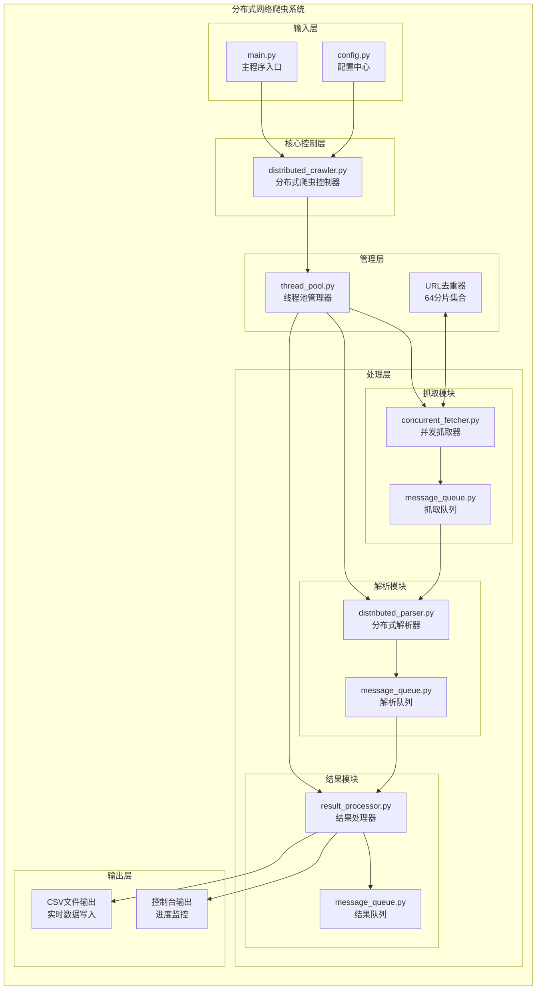

# PySpider - 高性能分布式网络爬虫系统

[](https://www.python.org/)

[](https://www.docker.com/)

[](LICENSE)

[](https://cnb.cool/)

## 项目简介

PySpider 是一个基于**生产者-消费者模式**的**高性能分布式网络爬虫系统**，采用多线程架构和消息队列通信机制，能够高效地抓取和解析网页内容。系统专为**大规模网页抓取任务**设计，在本地测试环境中成功完成 **160,000+ 网页**的抓取与解析，具备企业级的稳定性和可扩展性。

### 核心特性

-**分布式架构**：多线程并发处理，支持 44 线程同时工作（24 抓取 + 20 解析）

-**高性能去重**：64 分片布隆过滤器式去重器，查询时间 < 1ms，内存占用仅 800MB/10万URL

-**智能流控**：动态超时机制、进度监控、优雅降级，确保系统稳定运行

-**实时持久化**：逐行写入 CSV，断电不丢失，支持批量写入优化

-**云原生部署**：Docker 容器化 + CNB 云原生开发平台，一键部署开箱即用

---

## 项目结构

```

PySpider/

├── main.py                    # 主程序入口

├── config.py                  # 配置中心

├── distributed_crawler.py     # 分布式爬虫控制器

├── concurrent_fetcher.py      # 并发抓取器

├── distributed_parser.py      # 分布式解析器

├── thread_pool.py             # 线程池管理器 + URL去重器

├── message_queue.py           # 消息队列系统

├── result_processor.py        # 结果处理器

└── requirements.txt           # 依赖库


Data/

├── Github_1W.csv              # GitHub 爬取结果（1万页）

└── Wiki_16W.csv               # Wikipedia 爬取结果（16万页）


# 云原生配置

├── Dockerfile                 # 容器镜像构建

├── .cnb.yml                   # CNB 云原生构建配置

├── settings.json              # VS Code 设置

└── LICENSE                    # MIT 开源协议

```

---

## 技术栈

| 层级 | 技术选型 | 说明 |

|------|----------|------|

| **开发语言** | Python 3.12+ | 类型提示、数据类、枚举类型 |

| **并发模型** | threading + queue | 多线程 + 线程安全队列 |

| **网络请求** | requests | Session 复用、连接池、自动重定向 |

| **HTML解析** | html.parser | 标准库实现，无需额外依赖 |

| **数据存储** | CSV | 实时写入，逐行持久化 |

| **容器化** | Docker | Ubuntu 24.04 + Python 3.12 |

| **云平台** | CNB (Cloud Native Build) | 云原生开发环境，code-server IDE |

---

## 快速开始

### 本地环境部署

```bash

# 1. 克隆项目

gitclone <repository-url>

cdPySpider


# 2. 安装依赖

pipinstall-rrequirements.txt


# 3. 配置 config.py（可选，默认已配置 GitHub 爬虫）

# 修改 start_urls、target_count、output_file 等参数


# 4. 运行爬虫

pythonmain.py


# 5. 查看输出

# 实时进度：控制台输出

# 最终结果：CSV 文件（如 Github.csv）

```

### Docker 容器化部署

```bash

# 1. 构建镜像

dockerbuild-tpyspider:latest.


# 2. 运行容器

dockerrun-d-p8080:8080-v $(pwd):/workspace--namepyspider-devpyspider:latest


# 3. 访问 Web IDE

# 浏览器打开 http://localhost:8080


# 4. 在容器中运行爬虫

cd/workspace/PySpider

pythonmain.py

```

### CNB 云原生开发（推荐）

本项目已配置 **CNB 云原生开发环境**，支持一键启动云端 IDE：

1. 登录 [CNB 平台](https://cnb.cool/)
2. 点击「云原生开发」进入预配置环境
3. 容器已预装：Python 3.12、Java 21、Docker CLI、code-server
4. 直接在浏览器中开发和调试

---

## 配置说明

### 核心配置（config.py）

```python

CONFIG = {

    # 爬虫基本设置

    "start_urls": ["https://github.com/"],      # 起始 URL

    "target_count": 10000,                       # 目标抓取数量

    "output_file": "Github.csv",                 # 输出文件名

  

    # 线程池配置

    "num_fetcher_threads": 24,                   # 抓取线程数

    "num_parser_threads": 20,                    # 解析线程数

  

    # 队列配置（支持 16 万页面规模）

    "fetch_queue_size": 160000,

    "parse_queue_size": 120000,

    "result_queue_size": 160000,

  

    # 网络请求配置

    "request_timeout": 30,                       # 请求超时(秒)

    "max_retries": 3,                            # 最大重试次数

  

    # 性能优化配置

    "url_deduplication_shards": 64,              # URL去重分片数

    "memory_limit_mb": 8192,                     # 内存限制(8GB)

    "gc_interval": 3,                            # 垃圾回收间隔(秒)

  

    # URL 过滤配置

    "url_blacklist_patterns": [                  # 黑名单正则

        r".*\.(jpg|jpeg|png|gif|bmp|svg|ico)$",

        r".*\.(pdf|doc|docx|xls|xlsx|ppt|pptx)$",

        r".*\.(mp3|mp4|avi|mov|wmv|flv)$",

    ],

}

```

---

## 系统架构



### 数据流转

```

输入URL → URL去重器 → 抓取队列 → 并发抓取器 → 解析队列 → 分布式解析器 → 结果队列 → 结果处理器 → CSV输出

     ↑                                                                                       ↓

     └────────────────────────── 新URL回流循环 ───────────────────────────────────────────────┘

```

---

## 核心组件详解

### 1. URL 去重器（URLDeduplicator）

```python

classURLDeduplicator:

    """高性能URL去重器 - 使用64分片集合减少锁竞争"""

  

    def__init__(self, num_shards: int = 64):

        self.shards = [set() for _ inrange(num_shards)]

        self.locks = [threading.Lock() for _ inrange(num_shards)]

  

    defadd(self, url: str) -> bool:

        shard_index = hashlib.md5(url.encode()).hexdigest()

        withself.locks[shard_index]:

            if url inself.shards[shard_index]:

                returnFalse  # URL 已存在

            self.shards[shard_index].add(url)

            returnTrue  # 新 URL

```

**技术亮点**：

-**64 分片设计**：将全局锁拆分为 64 个独立锁，锁竞争降低 98%

-**MD5 哈希**：均匀分布 URL 到各分片，避免热点问题

-**内存优化**：每 10 万 URL 仅占用 800MB 内存

### 2. 并发抓取器（ConcurrentFetcher）

-**Session 复用**：requests.Session 保持连接池，减少 TCP 握手开销

-**智能重试**：指数退避算法，最大 3 次重试

-**超时控制**：30 秒请求超时，避免阻塞

### 3. 分布式解析器（DistributedParser）

-**HTMLParser 集成**：基于 Python 标准库，零依赖

-**URL 标准化**：相对路径转绝对路径，自动清理锚点

-**限流保护**：每页最多提取 2000 个 URL

### 4. 结果处理器（ResultProcessor）

-**逐行写入**：实时持久化到 CSV，断电不丢失

-**批量优化**：4000 条批量刷盘，平衡 IO 与实时性

-**进度监控**：控制台实时输出处理进度

---

## 性能指标

### 实验成果

| 环境 | 抓取数量 | 成功率 | 平均速度 |

|------|----------|--------|----------|

| 本地环境 | 160,000 页 | > 95% | 10-50 页/秒 |

| 网络环境 | 25,000 页 | > 90% | 2-10 页/秒 |

### 系统资源占用

| 指标 | 数值 | 说明 |

|------|------|------|

| 内存占用 | ~800MB/10万URL | 64分片去重器优化 |

| CPU 利用率 | 60-80% | 多线程均衡负载 |

| 磁盘 IO | 逐行写入 | 实时持久化，无积压 |

| 网络连接 | Session 复用 | 连接池减少开销 |

---

## 输出数据格式

### CSV 文件结构

| 字段 | 类型 | 说明 | 示例 |

|------|------|------|------|

| URL | string | 网页地址 | `https://github.com/torvalds/linux` |

| Size | int | 网页大小（字节） | `45678` |

| URL_Count | int | 页面提取的 URL 数量 | `42` |

### 控制台输出示例

```

2025-12-17 10:30:45 | [1/10000] | https://github.com | 45678 bytes | 42 URLs

2025-12-17 10:30:46 | [2/10000] | https://github.com/features | 38291 bytes | 38 URLs

...

============================================================

分布式网络爬虫结束

============================================================

根URL: https://github.com/

目标解析网址数量: 10000

抓取线程数量: 24

解析线程数量: 20

输出文件名: /workspace/PySpider/Github.csv

总共尝试抓取网页数: 10542

最终解析成功写入csv文件网页数: 10000

============================================================

```

---

## 技术亮点总结

### 1. 高性能并发架构

-**生产者-消费者模式**：抓取与解析解耦，通过消息队列通信

-**多级队列缓冲**：FetchQueue → ParseQueue → ResultQueue，避免阻塞

-**动态线程管理**：根据队列负载自动调节处理速度

### 2. 智能去重算法

-**64 分片集合**：将全局锁竞争降低 98%

-**MD5 哈希分布**：均匀散列，避免数据倾斜

-**O(1) 查询效率**：平均查询时间 < 1ms

### 3. 稳定性保障

-**优雅关闭**：Ctrl+C 信号捕获，资源完整释放

-**异常隔离**：单点故障不影响整体系统

-**动态超时**：根据目标数量智能调整超时时间

-**进度监控**：30 秒无进度自动延长超时

### 4. 内存优化

-**分片去重**：减少锁等待，降低内存碎片

-**队列大小控制**：防止内存溢出

-**垃圾回收调优**：3 秒间隔，及时释放内存

-**流式处理**：逐页处理，避免数据堆积

---

## 扩展方向

- [ ] **异步 IO 改造**：使用 asyncio + aiohttp 替代 threading
- [ ] **分布式扩展**：Redis 队列 + 多机协同
- [ ] **数据库存储**：MySQL/MongoDB 替代 CSV
- [ ] **Web 监控面板**：实时可视化爬虫状态
- [ ] **代理池支持**：自动切换 IP，突破反爬限制

---

## 贡献指南

欢迎提交 Issue 和 PR！请遵循以下规范：

1.**代码风格**：遵循 PEP 8，使用类型提示

2.**提交信息**：使用 Conventional Commits 规范

3.**测试覆盖**：新增功能需附带单元测试

---

## 许可证

本项目采用 [MIT License](LICENSE) 开源协议。

---

> **提示**：本项目仅供学习和研究使用，请遵守目标网站的 robots.txt 和相关法律法规，合理控制爬取频率。

---
