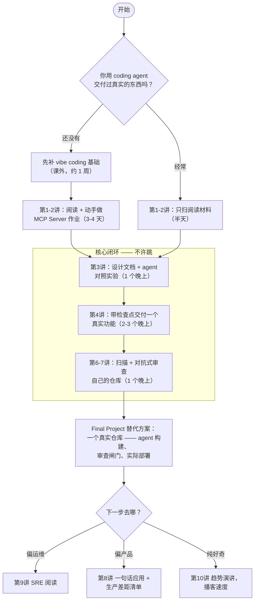

# CS146S 自学工作手册 2026：逐讲精华与配套实操路线

> 原文作者：Bruce · 发布于 2026-07-02 · 来源：[heyuan110.com](https://www.heyuan110.com/zh/posts/ai/2026-07-02-cs146s-study-guide/)

斯坦福 CS146S 自学不必按 10 周走：本文逐讲给出核心判断、最值得做的练习、2026 年工具映射（Claude Code/Cursor），附两周速通与六周完整两条路线图，以及替代 Final Project 的实操方案。

---

## 2026 年 7 月，CS146S 现在是什么状态

**2025 秋那一期仍然是最新的完整公开版本。** [ExploreCourses](https://explorecourses.stanford.edu/) 上 CS146S 只有 Autumn 2025-26 一条记录（3 学分，讲师 Mihail Eric），2026 春季没有开课。

2026-27 学年课表要到 8 月中旬才发布。但材料没有凉——[作业仓库](https://github.com/mihail911/modern-software-dev-assignments) 从我 2 月第一次写它时涨到了 3.8k stars、900+ forks。

讲师 Eric 把课压缩成 4 周，在 Maven 上开了付费公开版，2026 年 6 月期**已售罄**。

### 资源一览

| 资源 | 状态 | 国内访问 | 来源 |
|------|------|---------|------|
| 斯坦福正课 | 仅 2025 秋季一期 | — | [ExploreCourses](https://explorecourses.stanford.edu/) |
| 官网 + PPT | 全部公开 | 可直接访问 | [themodernsoftware.dev](https://themodernsoftware.dev) |
| 作业代码（8 周） | 公开，3.8k stars | 可直接访问 | [GitHub](https://github.com/mihail911/modern-software-dev-assignments) |
| 付费公开版 | Maven 4 周制，售罄 | 需国际信用卡 | [Maven](https://maven.com/the-modern-software-developer/ai-course) |
| 嘉宾演讲 | 部分可看（散见 YouTube） | 需自备网络条件 | — |
| 本站精读系列 | 五篇免费 | 可直接访问 | 本目录其他文件 |

---

## 逐讲总表：一句判断、一个练习、一个工具

| 讲 | 主题 | 我的判断 | 配套实操（2-4 小时） | 2026 工具 | 深读 |
|----|------|---------|---------------------|-----------|------|
| 1 | LLM 与提示词 | ★★☆ 必要的地基，别恋战 | 做 prompting playground 作业：同一提示词跑 10 次，量化方差 | 任意前沿模型 API | Karpathy LLM 深潜 |
| 2 | Agent 解剖与 MCP | ★★★ 全课最该动手的一个作业 | 徒手写一个 MCP Server，不用框架不用脚手架 | Claude Code + MCP SDK | [第一篇 §Week 2](01-cs146s-overview.md) |
| 3 | 上下文工程 | ★★★ 全课 ROI 最高 | 写一页设计文档喂给 agent，和裸提示词跑同一任务做 diff | Claude Code / Cursor rules | [第二篇：上下文工程](02-context-engineering.md) |
| 4 | Agent 协作模式 | ★★★ 从"写代码"到"管 Agent"的分水岭 | 用带检查点的方式指挥 agent 完整交付一个真实功能 | Claude Code plan mode | [第三篇：Agent Manager](03-agent-manager.md) |
| 5 | 现代终端 | ★☆☆ 终端老手可跳过 | 扫一眼 Warp vs Claude Code 的定位文档即可 | Warp（或直接跳过） | Warp University |
| 6 | 测试与安全 | ★★★ demo 和产品之间的那道闸门 | 对自己 vibe coding 出来的仓库跑安全扫描，数真假阳性 | Semgrep + agent 复审 | [第四篇：安全 Vibe Coding](04-secure-vibe-coding.md) |
| 7 | 代码审查 | ★★☆ 和第 6 讲捆着学 | 对抗式审查一个 AI PR：找出 agent 自己没发现的 3 个问题 | GitHub PR + 第二个 agent 当评审 | [第四篇](04-secure-vibe-coding.md) |
| 8 | 一句话建应用 | ★★☆ 好玩，但课在"差距"上 | 一句话生成一个应用，然后列出所有不能上生产的理由 | v0 / Lovable，然后 Claude Code | [第五篇](05-prototype-to-production.md) |
| 9 | 部署后运维 | ★★☆ 读就行，别搭（除非你做运维） | 用"agent 值班"的视角读 Google SRE 导论 | 纯阅读周 | [第五篇](05-prototype-to-production.md) |
| 10 | 软件工程的未来 | ★☆☆ 播客级内容，通勤听 | 有 Casado 演讲就看，没有就跳过 | — | [第一篇 §Week 10](01-cs146s-overview.md) |

---

## 课程的真实结构：四个模块，权重不等

官方大纲平铺十讲，平铺之下藏着一个权重严重不等的四模块结构。

- **模块一 · 地基（第 1-2 讲）**：W1 LLM 与提示词 → W2 Agent 解剖 + MCP
- **模块二 · Agent 手艺（第 3-5 讲）★ 核心**：W3 上下文工程 → W4 Agent 协作模式 → W5 终端（可选）
- **模块三 · 信任（第 6-7 讲）★ 核心**：W6 测试与安全 → W7 代码审查
- **模块四 · 交付与运维（第 8-10 讲）**：W8 一句话建应用 → W9 部署后运维 → W10 未来展望

模块二和模块三就是这门课本身。模块一是引桥，模块四是全景图。

---

## 逐讲笔记：判断的理由

### 第 1-2 讲：第 1 讲快进，第 2 讲动手

用了半年以上 AI 编程工具的人，第 1 讲基本是复习。但作业强迫你建立的实验心态——把提示词当成有可测方差的实验对象——是有价值的。

**第 2 讲是我在整门课里喊得最响的一次"必须做作业"。** 徒手写一个 MCP Server 是给 agent 祛魅最快的路径。

### 第 3 讲：全课 ROI 最高的一讲，禁止跳读

**只精读一讲的话，选这讲。** 上下文工程是"从 coding agent 拿到稳定输出的人"和"每次都在抽奖的人"之间的分界线。

### 第 4 讲：你从工程师变成管理者的那一讲

**第 4 讲耐久的内容是那条自主度光谱。** 它回答的是全行业都在绕圈的问题：给 agent 多大自主权、检查点设在哪。

### 第 5 讲：大概率可以跳

本来就活在终端里、天天跑 Claude Code 的人，直接跳。

### 第 6-7 讲：玩具和产品之间的闸门

**这两讲当一个整体学。** AI 代码的失效方式和人类代码不同——局部看处处正确，但在边界条件和信任边界上有系统性盲区。

### 第 8-10 讲：全景图，用播客速度过

第 8 讲的课在"差距"上，不在"生成"上。第 9 讲当阅读周处理。第 10 讲配得上你的通勤时间，配不上你的书桌时间。

---

## 自学路线：两周速通还是六周完整

| | 两周速通 | 六周完整 |
|--|---------|---------|
| **适合谁** | 已经每周指挥 agent 干活 | 还没用 agent 交付过真实的东西 |
| **前置** | 无 | 先花约 1 周跟上手型入门 |
| **第 1-2 讲** | 只扫阅读材料，半天 | 阅读 + MCP Server 作业，3-4 天 |
| **核心闭环** | 第 3 → 4 → 6/7 讲，三个连续练习块 | 同样三块，摊开到几周 |
| **项目** | 一个真实仓库，两个专注的周末 | 相同 |
| **模块四** | 按兴趣选，可不做 | 选修一讲 |

### 路径决策图

---

## Final Project 占总评 80%：自学者的替代方案

**一门课把分数排成 Final Project 80%、周作业 15%、课堂参与 5%，等于明说它不相信"读"能产生这项能力。**

替代方案规格：

1. **挑一个你真心希望它存在的东西。** 自学里稀缺的是动力，不是信息。
2. **生成任何代码之前先写设计文档**——约束、非目标、相关文件、业务规则（第 3 讲）。
3. **用带显式检查点的方式指挥 agent 构建**，而不是一口气收下一个巨型 diff（第 4 讲）。
4. **宣布完成之前先过闸门**：安全扫描加对抗式 agent 审查，修掉真问题（第 6-7 讲）。
5. **部署到带最低限度日志的环境**（第 8-9 讲，降低深度即可）。

整套流程两个专注的周末装得下。

---

## 这份手册的边界

两个诚实的限定。第一，本文全部基于 2025 秋季的公开材料——截至 2026 年 7 月这是最新的完整版本。第二，这份手册刻意用深度换导航——每个核心讲值得的篇幅远超"一句判断加一个练习"，所以五篇精读系列才存在。用这一页决定把时间花在哪，用那五篇去把时间花掉。

---

> **相关阅读**
>
> - [斯坦福 CS146S 全解析（第一篇）：课程综述](01-cs146s-overview.md)
> - [第二篇：上下文工程](02-context-engineering.md)
> - [第三篇：Agent Manager](03-agent-manager.md)
> - [第四篇：安全 Vibe Coding](04-secure-vibe-coding.md)
> - [第五篇：原型到生产](05-prototype-to-production.md)