# 🎓 斯坦福 CS146S — The Modern Software Developer

> 课程资料中文精读合集 · 整理于 2026-07-21

---

## 课程简介

**CS146S** 是斯坦福大学 2025 秋季首次开设的 AI 编程课程（The Modern Software Developer），由 **Mihail Eric** 主讲。课程覆盖从 LLM 原理到 Agent 架构、从上下文工程到安全攻防、从自动化构建到生产运维的完整软件工程生命周期，嘉宾包括 Claude Code 创始人、Vercel AI 研究负责人、Semgrep CEO、a16z 合伙人等业界领袖。

**课程官网**：[themodernsoftware.dev](https://themodernsoftware.dev)  
**作业代码**：[GitHub 仓库](https://github.com/mihail911/modern-software-dev-assignments)（3.8k ⭐）

---

## 📂 文件列表

| # | 文件名 | 主题 | 对应课程周 | 字数 | 发布日期 |
|---|--------|------|-----------|------|---------|
| 1 | [01-cs146s-overview.md](01-cs146s-overview.md) | **课程全解析**——10 周大纲、嘉宾阵容、资源指南、全球高校跟进、相关阅读 | Week 1-10 | ~1084 | 2026-02-24 |
| 2 | [02-context-engineering.md](02-context-engineering.md) | **上下文工程**——Spec 是新源代码、四种失败模式（含详细案例）、Context Rot、工具设计五原则、Cognition 视角、实战代码示例 | Week 3 | ~712 | 2026-02-24 |
| 3 | [03-agent-manager.md](03-agent-manager.md) | **Agent Manager**——自治度光谱、Anthropic 五大模式详解、Boris Cherney 演讲、2.5 倍生产力实践、核心能力模型（含反模式） | Week 4 | ~610 | 2026-02-24 |
| 4 | [04-secure-vibe-coding.md](04-secure-vibe-coding.md) | **安全 Vibe Coding**——Prompt Injection 真实案例（含攻击代码）、OWASP 新威胁、AI 漏洞检测细分表、七步审查法（含详细清单）、五道防线（含安全规则代码） | Week 6-7 | ~647 | 2026-02-24 |
| 5 | [05-prototype-to-production.md](05-prototype-to-production.md) | **从原型到生产**——v0 能力边界、六道关卡（含详细说明）、多技术栈实战作业、AI 参与度分析、系列总结 | Week 8-9 | ~679 | 2026-02-24 |
| 6 | [06-study-guide-2026.md](06-study-guide-2026.md) | **自学工作手册 2026**——逐讲判断总表、课程四模块结构、两周/六周路线图、Final Project 替代方案 | Week 1-10 | ~837 | 2026-07-02 |

---

## 🗺️ 推荐阅读路线

### 按顺序系统学习

```
01 (总览) → 02 (上下文) → 03 (Agent管理) → 04 (安全) → 05 (交付) → 06 (自学路线)
```

### 按需求选择

| 目标 | 推荐阅读 |
|------|---------|
| 快速了解课程全貌 | [01 课程全解析](01-cs146s-overview.md) |
| 提升 AI 编程输出质量 | [02 上下文工程](02-context-engineering.md) |
| 学会管理 AI Agent | [03 Agent Manager](03-agent-manager.md) |
| 保障代码安全 | [04 安全 Vibe Coding](04-secure-vibe-coding.md) |
| 从 Demo 到上线 | [05 从原型到生产](05-prototype-to-production.md) |
| 制定自学计划 | [06 自学工作手册 2026](06-study-guide-2026.md) |

---

## 📊 课程核心模块

```mermaid
flowchart LR
    subgraph M1["模块一 · 地基（第1-2讲）"]
        direction LR
        W1["W1 LLM 原理与提示词工程"] --> W2["W2 Agent 架构 + MCP 协议"]
    end
    subgraph M2["模块二 · Agent 手艺（第3-5讲） ★ 核心"]
        direction LR
        W3["W3 上下文工程（ROI 最高）"] --> W4["W4 Agent 协作模式与自治度管理"] --> W5["W5 现代终端（可选）"]
    end
    subgraph M3["模块三 · 信任（第6-7讲） ★ 核心"]
        direction LR
        W6["W6 测试与安全"] --> W7["W7 代码审查"]
    end
    subgraph M4["模块四 · 交付与运维（第8-10讲）"]
        direction LR
        W8["W8 一句话建应用"] --> W9["W9 部署后运维"] --> W10["W10 未来展望"]
    end
    M1 --> M2 --> M3 --> M4
```



---

## ⭐ 逐讲价值判断

| 讲 | 主题 | 价值 | 建议 |
|----|------|------|------|
| 1 | LLM 与提示词 | ★★☆ | 必要地基，别恋战 |
| 2 | Agent 解剖与 MCP | ★★★ | **全课最该动手的作业** |
| 3 | 上下文工程 | ★★★ | **全课 ROI 最高，禁止跳读** |
| 4 | Agent 协作模式 | ★★★ | 从写代码到管 Agent 的分水岭 |
| 5 | 现代终端 | ★☆☆ | 终端老手可跳过 |
| 6 | 测试与安全 | ★★★ | **Demo 和产品之间的闸门** |
| 7 | 代码审查 | ★★☆ | 和第 6 讲捆着学 |
| 8 | 一句话建应用 | ★★☆ | 课在"差距"上，不在生成上 |
| 9 | 部署后运维 | ★★☆ | 读就行，别搭 |
| 10 | 软件工程的未来 | ★☆☆ | 播客级内容，通勤听 |

---

## 🔗 相关资源

- [课程官网](https://themodernsoftware.dev) — 大纲、PPT、阅读材料
- [作业代码仓库](https://github.com/mihail911/modern-software-dev-assignments) — 8 周作业，Python 3.12 + Poetry
- [Maven 付费版](https://maven.com/the-modern-software-developer/ai-course) — 4 周压缩版（已售罄）
- [ExploreCourses](https://explorecourses.stanford.edu/) — 斯坦福课程系统

---

> 本合集内容来源于 [Bruce AI 工程笔记](https://www.heyuan110.com/zh/posts/)，经整理提取为 Markdown 文件，方便离线阅读和自学使用。

---

## 📖 完整教学大纲

> 以下内容整合自 [ShouZhengAI/CS146S_CN](https://github.com/ShouZhengAI/CS146S_CN) 中文版课程，包含每周主题、阅读材料、作业、嘉宾演讲和 Slides 链接。

### 课程简介

近几年来，大型语言模型（LLM）为软件开发带来了革命性的新范式。传统的软件开发生命周期正在被人工智能的自动化能力渗透和重塑，这引发了一个关键问题：**下一代软件工程师应如何利用这些进步，将工作效率提升十倍（10x），并为未来的职业生涯做好准备？**

本课程将证明，现代人工智能工具不仅能大幅提高开发人员的生产力，还能让更广泛的受众更容易接触和从事软件工程工作。我们将展示，软件开发已经从"从零开始"（0-1）的代码编写，演变为一个迭代工作流程：**规划、利用AI生成、修改，然后重复**。

**先决条件**：具备相当于 CS111 级别的编程经验。推荐具备 CS221/229 课程知识。

**形式**：每周讲座、动手编码实践课，以及行业嘉宾演讲。期末项目要求展示现代开发实践。

**评分**：期末项目 80%，每周作业 15%，课堂参与 5%

---

### 第 1 周：编码 LLM 和 AI 开发简介

**主题**
- 课程安排
- LLM 到底是什么
- 如何有效进行 Prompt

**阅读材料**
- [Deep Dive into LLMs](https://www.youtube.com/watch?v=7xTGNNLPyMI) — [b站中文版](https://www.bilibili.com/video/BV16cNEeXEer)
- [Prompt Engineering Overview](https://cloud.google.com/discover/what-is-prompt-engineering) — [中文版](https://www.yuque.com/wangjiandong/gwcyhv/uw3b7we9pmdubdig)
- [Prompt Engineering Guide](https://www.promptingguide.ai/techniques) — [中文版](https://www.yuque.com/wangjiandong/gwcyhv/ziny243nwrodmew3)
- [AI Prompt Engineering: A Deep Dive](https://www.youtube.com/watch?v=T9aRN5JkmL8) — [b站中文版](https://www.bilibili.com/video/BV18ukBYzEQG)
- [How OpenAI Uses Codex](https://cdn.openai.com/pdf/6a2631dc-783e-479b-b1a4-af0cfbd38630/how-openai-uses-codex.pdf)

**课后作业**：[LLM Prompting Playground](https://github.com/mihail911/modern-software-dev-assignments/tree/master/week1)

**Slides**：
- 9/22 简介及 LLM 原理 — [Slides](https://raw.githubusercontent.com/ShouZhengAI/CS146S_CN/main/Resource/pdfs/1_1%20Introduction%20and%20how%20an%20LLM%20is%20made.pdf) / [中文PPT](https://raw.githubusercontent.com/ShouZhengAI/CS146S_CN/main/Resource/pdfs/1_1%20Introduction%20and%20how%20an%20LLM%20is%20made_CN.pdf)
- 9/26 LLM 的高效提示 — [Slides](https://raw.githubusercontent.com/ShouZhengAI/CS146S_CN/main/Resource/pdfs/1_2%20Power%20prompting%20for%20LLMs.pdf) / [中文PPT](https://raw.githubusercontent.com/ShouZhengAI/CS146S_CN/main/Resource/pdfs/1_2%20Power%20prompting%20for%20LLMs_CN.pdf)

---

### 第 2 周：编码智能体剖析

**主题**
- 智能体架构和组件
- 工具使用和函数调用
- MCP（模型上下文协议）

**阅读材料**
- [MCP Introduction](https://stytch.com/blog/model-context-protocol-introduction/)
- [Sample MCP Server Implementations](https://github.com/modelcontextprotocol/servers)
- [MCP Server Authentication](https://developers.cloudflare.com/agents/guides/remote-mcp-server/#add-authentication)
- [MCP Server SDK](https://github.com/modelcontextprotocol/typescript-sdk/tree/main?tab=readme-ov-file#server)
- [MCP Registry](https://blog.modelcontextprotocol.io/posts/2025-09-08-mcp-registry-preview/)
- [MCP Food-for-Thought](https://www.reillywood.com/blog/apis-dont-make-good-mcp-tools/)

**课后作业**：[First Steps in the AI IDE](https://github.com/mihail911/modern-software-dev-assignments/tree/master/week2)

**Slides**：
- 9/29 从零开始构建一个编码智能体 — [Slides](https://raw.githubusercontent.com/ShouZhengAI/CS146S_CN/main/Resource/pdfs/2_1%20Building%20a%20coding%20agent%20from%20scratch.pdf)，[练习代码](https://raw.githubusercontent.com/ShouZhengAI/CS146S_CN/main/Resource/completed/coding_agent_from_scratch_lecture.py)
- 10/3 构建一个自定义 MCP 服务器 — [Slides](https://raw.githubusercontent.com/ShouZhengAI/CS146S_CN/main/Resource/pdfs/2_2%20Building%20a%20coding%20agent%20from%20scratch.pdf)，[练习代码](https://raw.githubusercontent.com/ShouZhengAI/CS146S_CN/main/Resource/completed/simple_mcp.py)

---

### 第 3 周：AI 集成开发环境（IDE）

**主题**
- 上下文管理和代码理解
- 智能体的产品需求文档（PRD）
- IDE 集成和扩展

**阅读材料**
- [Specs Are the New Source Code](https://blog.ravi-mehta.com/p/specs-are-the-new-source-code)
- [How Long Contexts Fail](https://www.dbreunig.com/2025/06/22/how-contexts-fail-and-how-to-fix-them.html)
- [Devin: Coding Agents 101](https://devin.ai/agents101#introduction)
- [Getting AI to Work In Complex Codebases](https://github.com/humanlayer/advanced-context-engineering-for-coding-agents/blob/main/ace-fca.md)
- [How FAANG Vibe Codes](https://x.com/rohanpaul_ai/status/1959414096589422619)
- [Writing Effective Tools for Agents](https://www.anthropic.com/engineering/writing-tools-for-agents)

**课后作业**：[Build a Custom MCP Server](https://github.com/mihail911/modern-software-dev-assignments/blob/master/week3/assignment.md)

**嘉宾**：[Silas Alberti](https://www.linkedin.com/in/silasalberti/)（Cognition 研究负责人）

**Slides**：
- 10/6 从首次提示到最佳 IDE 设置 — [Slides](https://raw.githubusercontent.com/ShouZhengAI/CS146S_CN/main/Resource/pdfs/3_1%20Building%20a%20coding%20agent%20from%20scratch.pdf)，[设计文档模板](https://raw.githubusercontent.com/ShouZhengAI/CS146S_CN/main/Resource/completed/design_doc_template.md)
- 10/10 Silas Alberti 嘉宾演讲 — [Slides](https://raw.githubusercontent.com/ShouZhengAI/CS146S_CN/main/Resource/pdfs/3_2%20Silas%20Alberti,%20Head%20of%20Research.pdf)

---

### 第 4 周：编码智能体模式

**主题**
- 管理智能体自治级别
- 人与智能体协作模式

**阅读材料**
- [How Anthropic Uses Claude Code](https://www-cdn.anthropic.com/58284b19e702b49db9302d5b6f135ad8871e7658.pdf)
- [Claude Best Practices](https://www.anthropic.com/engineering/claude-code-best-practices)
- [Awesome Claude Agents](https://github.com/vijaythecoder/awesome-claude-agents)
- [Super Claude](https://github.com/SuperClaude-Org/SuperClaude_Framework)
- [Good Context Good Code](https://blog.stockapp.com/good-context-good-code/)
- [Peeking Under the Hood of Claude Code](https://medium.com/@outsightai/peeking-under-the-hood-of-claude-code-70f5a94a9a62)

**课后作业**：[Coding with Claude Code](https://github.com/mihail911/modern-software-dev-assignments/blob/master/week4/assignment.md)

**嘉宾**：[Boris Cherney](https://www.linkedin.com/in/bcherny/)（Claude Code 创建者）

**Slides**：
- 10/13 如何成为一名智能体管理者 — [Slides](https://docs.google.com/presentation/d/19mgkwAnJDc7JuJy0zhhoY0ZC15DiNpxL8kchPDnRkRQ/edit?usp=sharing)
- 10/17 Boris Cherney 嘉宾演讲 — [Slides](https://docs.google.com/presentation/d/1bv7Zozn6z45CAh-IyX99dMPMyXCHC7zj95UfwErBYQ8/edit?usp=sharing)

---

### 第 5 周：现代终端

**主题**
- AI 增强的命令行界面
- 终端自动化和脚本编写

**阅读材料**
- [Warp University](https://www.warp.dev/university?slug=university)
- [Warp vs Claude Code](https://www.warp.dev/university/getting-started/warp-vs-claude-code)
- [How Warp Uses Warp to Build Warp](https://notion.warp.dev/How-Warp-uses-Warp-to-build-Warp-21643263616d81a6b9e3e63fd8a7380c)

**课后作业**：[Agentic Development with Warp](https://github.com/mihail911/modern-software-dev-assignments/tree/master/week5)

**嘉宾**：[Zach Lloyd](https://www.linkedin.com/in/zachlloyd/)（Warp CEO）

**Slides**：
- 10/20 如何打造一款爆款 AI 开发者产品 — [Slides](https://docs.google.com/presentation/d/1Djd4eBLBbRkma8rFnJAWMT0ptct_UGB8hipmoqFVkxQ/edit?usp=sharing)
- 10/24 Zach Lloyd 嘉宾演讲 — [Slides](https://www.figma.com/slides/kwbcmtqTFQMfUhiMH8BiEx/Warp---Stanford--Copy-?node-id=9-116&t=oBWBCk8mjg2l2NR5-1)

---

### 第 6 周：AI 测试与安全

**主题**
- 安全的 Vibe coding
- 漏洞检测的历史
- AI 生成的测试套件

**阅读材料**
- [SAST vs DAST](https://www.splunk.com/en_us/blog/learn/sast-vs-dast.html)
- [Copilot RCE via Prompt Injection](https://embracethered.com/blog/posts/2025/github-copilot-remote-code-execution-via-prompt-injection/)
- [Finding Vulnerabilities Using Claude Code and OpenAI Codex](https://semgrep.dev/blog/2025/finding-vulnerabilities-in-modern-web-apps-using-claude-code-and-openai-codex/)
- [Agentic AI Threats: Identity Spoofing and Impersonation](https://unit42.paloaltonetworks.com/agentic-ai-threats/)
- [OWASP Top Ten](https://owasp.org/www-project-top-ten/)
- [Context Rot: Understanding Degradation in AI Context Windows](https://research.trychroma.com/context-rot)
- [Vulnerability Prompt Analysis with O3](https://github.com/SeanHeelan/o3_finds_cve-2025-37899/blob/master/system_prompt_uafs.prompt)

**课后作业**：[Writing Secure AI Code](https://github.com/mihail911/modern-software-dev-assignments/blob/master/week6/assignment.md)

**嘉宾**：[Isaac Evans](https://www.linkedin.com/in/isaacevans/)（Semgrep CEO）

**Slides**：
- 10/27 AI QA、SAST、DAST 及未来 — [Slides](https://docs.google.com/presentation/d/1C05bCLasMDigBbkwdWbiz4WrXibzi6ua4hQQbTod_8c/edit?usp=sharing)

---

### 第 7 周：现代软件支持

**主题**
- 我们可以信任哪些 AI 代码系统
- 调试与诊断
- 智能文档生成

**阅读材料**
- [Code Reviews: Just Do It](https://blog.codinghorror.com/code-reviews-just-do-it/)
- [How to Review Code Effectively](https://github.blog/developer-skills/github/how-to-review-code-effectively-a-github-staff-engineers-philosophy/)
- [AI-Assisted Assessment of Coding Practices in Modern Code Review](https://arxiv.org/pdf/2405.13565)
- [AI Code Review Implementation Best Practices](https://graphite.dev/guides/ai-code-review-implementation-best-practices)
- [Code Review Essentials for Software Teams](https://blakesmith.me/2015/02/09/code-review-essentials-for-software-teams.html)
- [Lessons from millions of AI code reviews](https://www.youtube.com/watch?v=TswQeKftnaw)

**课后作业**：[Code Review Reps](https://github.com/mihail911/modern-software-dev-assignments/tree/master/week7)

**嘉宾**：[Tomas Reimers](https://www.linkedin.com/in/tomasreimers/)（Graphite CPO）

**Slides**：
- 11/3 AI 代码审查 — [Slides](https://docs.google.com/presentation/d/1NkPzpuSQt6Esbnr2-EnxM9007TL6ebSPFwITyVY-QxU/edit?usp=sharing)
- 11/7 Tomas Reimers 嘉宾演讲 — [Slides](https://drive.google.com/file/d/1hwF-RIkOJ_OFy17BKhzFyCtxSS7Pcf7p/view?usp=drive_link)

---

### 第 8 周：自动化 UI 和应用程序构建

**主题**
- 面向所有人的设计和前端开发
- 快速 UI/UX 原型设计和迭代

**课后作业**：[Multi-stack Web App Builds](https://github.com/mihail911/modern-software-dev-assignments/tree/master/week8)

**嘉宾**：[Gaspar Garcia](https://www.linkedin.com/in/gaspargarcia/)（Vercel AI 研究负责人）

**Slides**：
- 11/10 通过单个提示词实现端到端应用程序 — [Slides](https://docs.google.com/presentation/d/1GrVLsfMFIXMiGjIW9D7EJIyLYh_-3ReHHNd_vRfZUoo/edit?usp=sharing)
- 11/14 Gaspar Garcia 嘉宾演讲 — [Slides](https://docs.google.com/presentation/d/1Jf2aN5zIChd5tT86rZWWqY-iDWbxgR-uynKJxBR7E9E/edit?usp=sharing)

---

### 第 9 周：智能体部署后

**主题**
- AI 系统的监控和可观测性
- 自动化事件响应
- 分诊和调试

**阅读材料**
- [Introduction to SRE](https://sre.google/sre-book/introduction/)
- [Observability Basics You Should Know](https://last9.io/blog/traces-spans-observability-basics/)
- [Kubernetes Troubleshooting with AI](https://resolve.ai/blog/kubernetes-troubleshooting-in-resolve-ai)
- [Your New Autonomous Teammate](https://resolve.ai/blog/product-deep-dive)
- [Role of Multi Agent Systems in Making Software Engineers AI-native](https://resolve.ai/blog/role-of-multi-agent-systems-AI-native-engineering)
- [Benefits of Agentic AI in On-call Engineering](https://resolve.ai/blog/Top-5-Benefits)

**嘉宾**：[Mayank Agarwal](https://www.linkedin.com/in/mayank-ag/)（Resolve CTO）和 [Milind Ganjoo](https://www.linkedin.com/in/mganjoo/)（Resolve 技术人员）

**Slides**：
- 11/17 事件响应和 DevOps — [Slides](https://docs.google.com/presentation/d/1Mfe-auWAsg9URCujneKnHr0AbO8O-_U4QXBVOlO4qp0/edit?usp=sharing)
- 11/21 嘉宾演讲 — [Slides](https://drive.google.com/file/d/11WnEbMGc9kny_WBpMN10I8oP8XsiQOnM/view?usp=sharing)

---

### 第 10 周：AI 软件工程的未来展望

**主题**
- 软件开发角色的未来
- 新兴的 AI 编码范式
- 行业趋势与预测

**嘉宾**：[Martin Casado](https://a16z.com/author/martin-casado/)（a16z 普通合伙人）

**Slides**：
- 12/1 十年后的软件开发
- 12/5 Martin Casado 嘉宾演讲

---

### 相关项目资源

| 名称 | 简要 | 链接 |
|------|------|------|
| datawhalechina/vibe-vibe | 首个系统化 Vibe Coding 开源教程，从零基础到全栈实战 | [GitHub](https://github.com/datawhalechina/vibe-vibe) |
| tukuaiai/vibe-coding-cn | Vibe Coding 中文翻译 + 个人开发经验 + 提示词库 | [GitHub](https://github.com/tukuaiai/vibe-coding-cn) |
| Awesome Vibe Coding | 精选的 vibe coding 参考列表，包括工具、概念和提示工程指南 | [GitHub](https://github.com/filipecalegario/awesome-vibe-coding) |

> 中文版课程项目地址：[ShouZhengAI/CS146S_CN](https://github.com/ShouZhengAI/CS146S_CN) — 感谢中文社区的同仁们对课程内容的翻译和整理。