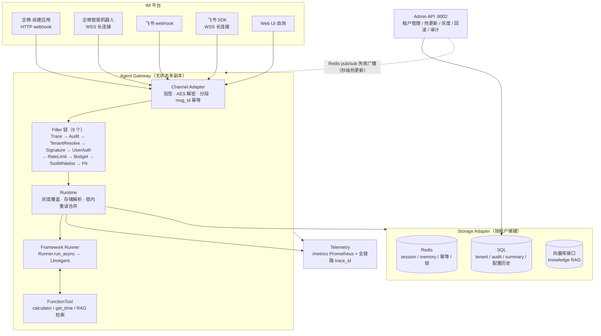
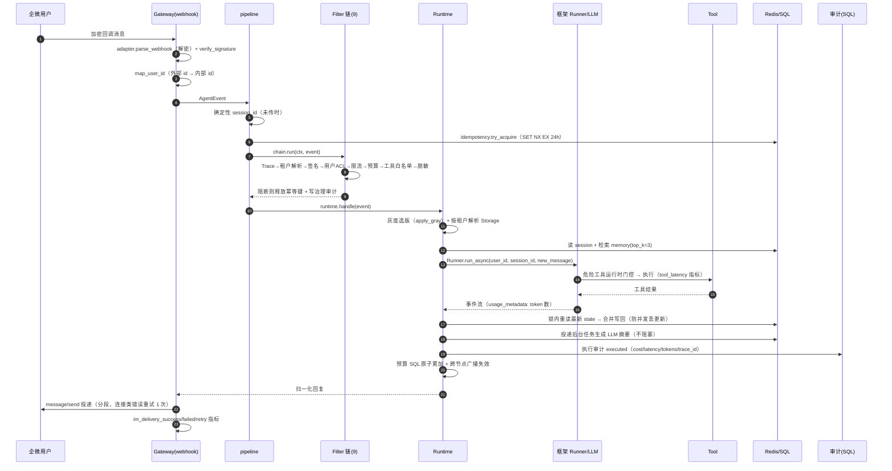

# Teneuris — tRPC-Agent-Service 项目全解

> 用途：**复习速查 + 简历/面试取材**。本文按「能讲清楚的设计」而非「代码目录顺序」组织，所有结论均可在仓库源码中定位到具体文件与行号。
> 主 spec 见 `docs/PRD.md`，详设见 `docs/DESIGN-*.md`，实测证据见 `docs/VERIFICATION.md`。

---

## 0. 我给这份文档补了什么（相比"项目介绍"）

你原本的需求是"记录设计与知识点"，但用于**复习 + 简历**时，光有设计描述不够。我在通读源码后额外补了这些板块：

| 补充板块 | 为什么必须有 |
| --- | --- |
| §1 简历标签 + 一句话定位 | 简历上写项目第一句就卡壳，需要可复制的成品表述 |
| §3.2 三个基石决策 | 面试官只问"你为什么这么设计"，不是"你做了什么" |
| §10 并发一致性与可靠性 | 分布式锁 / 幂等 / 丢失更新是后端高频考点，本项目有真实落地 |
| §13 部署与运维 | 证明"能上线"而非"能跑 demo" |
| §16 踩坑实录 | 全是实测结论（框架坑 / 协议坑），面试杀手锏，别人编不出来 |
| §17 复用 vs 自研 | 直接对应"你在这个项目里到底贡献了什么" |
| §18 简历写法 + 面试问答 | 把你做的事翻译成可投递、可口述的版本 |
| §19 常量速查表 | 复习时快速回忆数字细节（TTL / 维度 / 分段长度 / 单价） |

---

## 1. 项目定位

### 1.1 一句话

**Teneuris** = **Tenant**（租户）+ **Neur**（神经元）+ **-is**（系统）。基于 tRPC-Agent-Python 构建的**多租户、节点化、多后端 AI Agent 部署平台**：框架提供 Agent 编排 / Tool / Session / Memory / Knowledge / Telemetry，平台层补齐**多租户隔离、无状态多节点、治理运维**，把 Agent 能力从单点 Demo 扩展为可统一管理的平台化服务。

### 1.2 简历可复制标签

```
Teneuris 多租户 AI Agent 平台 | Python 3.12 · tRPC-Agent-Python · FastAPI · Redis · SQLAlchemy · K8s
- 设计无状态多节点 Agent 网关：会话/记忆/幂等全外置 Redis+SQL，无 sticky session，支持 HPA 弹性伸缩
- 落地 9 层治理 Filter 链（trace/租户/验签/ACL/限流/预算/工具白名单/PII/审计），治理与业务解耦
- 实现多租户数据隔离与按租户可插拔后端（Redis/SQL/向量/对象存储 4 类），支持跨后端迁移与热切换
- 接入 4 种 IM 形态（企微 webhook + 长连接、飞书 webhook + SDK 长连接），手写官方验签/AES 协议
- 成本闭环：token 计量 → SQL 原子累加 → 预算硬限；按用户哈希灰度 + 配置快照 + 一键回滚
- 质量：282 单测通过 / 覆盖率 84% / flake8 0 条；Docker + Kustomize 生产部署（HPA/PDB/探针/fail-closed）
```

### 1.3 关键量化指标

| 指标 | 值 |
| --- | --- |
| 单测 | 282 passed（`tests/` 20 个测试模块） |
| 覆盖率 | 84% |
| 静态检查 | flake8 0 条 |
| 框架版本 | `trpc-agent-py == 1.1.20`（uv.lock 锁定） |
| Python | ≥ 3.12 |
| 治理 Filter | 9 个 |
| 数据域 | 8 个（session/memory/knowledge/summary/audit/artifact/idempotency/lock） |
| IM 形态 | 4 种真实 + 1 种 Web 自测 |
| 生产风险条目 | 11 项（验收要求 ≥8） |

---

## 2. 技术栈全景

### 2.1 运行时与框架

| 层 | 选型 | 说明 |
| --- | --- | --- |
| 语言 | Python 3.12 | asyncio 全异步 |
| Agent 框架 | **trpc-agent-py 1.1.20**（import 名 `trpc_agent_sdk`） | Runner / LlmAgent / FunctionTool / BaseSessionService / BaseMemoryService / KnowledgeBase |
| Web | FastAPI ≥0.116 + Uvicorn ≥0.35 | Gateway(:8000) + Admin(:8002) |
| 数据校验 | Pydantic v2（≥2.11） | 配置模型 `PlatformSettings` / `TenantConfig`，`SecretStr` 承载密钥 |
| 配置 | PyYAML + python-dotenv | yaml + `.env` + `TENEURIS_*` 环境变量三层覆盖 |

### 2.2 存储

| 用途 | 选型 | 备注 |
| --- | --- | --- |
| 热状态 / 锁 / 幂等 | Redis（`redis.asyncio`，≥5.0） | Session/Memory/限流/幂等/分布式锁/pub-sub |
| 强一致持久化 | SQLAlchemy 2.0 async | aiosqlite（本地）/ aiomysql（生产） |
| 向量检索 | 自研哈希 embedding（零依赖，Redis 存） | 生产可换 pgvector，接口不变 |
| 对象存储 | `ArtifactStore` 抽象（InMemory 占位） | 生产换 S3/MinIO |

### 2.3 安全 / IM / 可观测

| 用途 | 选型 |
| --- | --- |
| 加解密 | `cryptography`（AES-256-CBC） |
| HTTP 客户端 | `httpx`（IM API 调用 / access_token） |
| 企微机器人长连接 | `wecom-aibot-python-sdk`（import 名 `aibot`） |
| 飞书长连接 | `lark-oapi >=1.7.3,<1.8.0`（`FeishuChannel`） |
| 指标 | `prometheus-client`（`/metrics`） |
| 追踪 | 自研 `trace_id` 全链路贯穿（等价 tracing） |

### 2.4 工程 / 质量 / 部署

| 用途 | 选型 |
| --- | --- |
| 依赖管理 | `uv`（`uv.lock` 精确锁定 115 包）+ `hatchling` 构建 |
| 测试 | pytest + pytest-asyncio（`asyncio_mode=auto`）+ pytest-cov |
| 质量门禁 | flake8 + yapf；`gate-check.sh` 一键跑 |
| 容器 | 多阶段 Dockerfile（deps: uv sync --frozen → runtime: python:3.12-slim，非 root UID 10001） |
| 本地编排 | docker-compose（2×Gateway + Redis 7） |
| 生产 | Kubernetes + Kustomize（Deployment 多副本 + HPA + PDB + Secret + 探针） |

---

## 3. 架构

### 3.1 分层架构



### 3.2 三个基石决策（面试必讲）

#### 决策一：一切状态外置，Worker 无状态

对话历史在 Redis、配置与审计在 SQL、幂等键与分布式锁也在 Redis——**Gateway 进程不存任何业务状态**，因此不需要 sticky session。

关键技巧：`session_id` 由 `sha256(tenant + channel + 群/用户)` **确定性生成**（`tenant/resolver.py:82-96`），同一用户永远落到同一 session。**"路由到正确 session"这个问题在生成规则层面被消解**，而不是靠会话亲和或路由表。

```python
# tenant/resolver.py:94-96
scope = "group" if is_group else "user"
raw = f"{tenant_id}:{channel_type}:{channel_id}:{scope}:{external_user_id}"
return hashlib.sha256(raw.encode()).hexdigest()[:32]
```

#### 决策二：治理前置成 Filter 链，与业务解耦

每条消息进 Agent 前依次过 9 个 Filter。阻断抛 `FilterBlocked` 短路；审计 Filter 放在**洋葱外层**（Trace 之内），借助 `_after` 无论成败都执行的语义，**保证被阻断/异常流量同样留痕**（`filters/base.py:96-103`）。

#### 决策三：数据按性质选后端与一致性等级

会话热状态走 Redis（低延迟、最终一致）；租户/审计/摘要走 SQL（强一致）；知识检索走向量（最终一致）；Artifact 预留对象存储接口。**并且每个租户可以 independently 选择各数据域后端**（`DataBackendConfig`）。

### 3.3 目录结构与模块职责

```text
trpc_service/
|-- _cli.py          # CLI 入口（gateway / admin / knowledge-add / migrate / demo-tenant）
|-- bootstrap.py     # 网关装配层（从 _cli 抽出，可脱离 CLI 单测）
|-- events.py        # AgentEvent / AgentResponse / AgentResponseChunk
|-- agent/           # Agent 构建：builder（LlmAgent 组装）/ model_factory（LLMModel）/ summarizer
|-- channels/        # IM 通道：base(抽象) / factory / web / wechat_work / wecom_bot / feishu / feishu_sdk
|-- config/          # settings(PlatformSettings) / loader(yaml+env) / redaction(PII 脱敏)
|-- filters/         # base(洋葱 FilterChain) / context / impl(9 个) / rate_limiter
|-- log/             # 结构化 JSON 日志 + 脱敏
|-- metrics/         # Prometheus 指标注册表
|-- runtime/         # pipeline(幂等→链→Runtime) / runtime(编排) / runner(框架 Runner 包装) / events
|-- storage/         # base(8 域抽象) / factory / manager / inmemory / redis_store / redis_memory
|                    # sql_store / knowledge_{inmemory,redis,vector} / framework_adapter / migration
|-- tenant/          # models / registry(LRU) / resolver / budget / gray / broadcaster
|-- tool/            # registry(内置工具+权限过滤) / builder(FunctionTool 适配)
`-- web/             # app(Gateway FastAPI) / admin(Admin API) / templates/*.html
```

**依赖方向严格单向**：`agent → tool`（tool 不知道 agent 存在）；`runtime → filters` 仅类型期导入（`TYPE_CHECKING`）；`storage` 不反向依赖业务层。

---

## 4. 核心链路：一条消息的一生

### 4.1 时序图



### 4.2 逐步拆解（含源码位置）

| 步骤 | 位置 | 要点 |
| --- | --- | --- |
| 1. 解析 | `channels/wechat_work.py:149` `parse_webhook` | XML → AES 解密 → `AgentEvent`；填充 `msg_id`/`user_id`/`content`/`is_group` |
| 2. 验签 | `channels/wechat_work.py:119` | `SHA1(sort(token,timestamp,nonce,encrypt))`，`hmac.compare_digest` 防时序侧信道 |
| 3. 撤回短路 | `web/app.py:218` | 撤回**不触发 Agent**，只记审计 + 标记历史 `revoked` |
| 4. 身份映射 | `web/app.py:233` | 外部 id → 内部 id（供 ACL/审计/session），原始 id 存 `metadata.external_user_id` 用于回投 |
| 5. 幂等 | `runtime/pipeline.py:57-67` | key `idempotency:{tenant}:{channel}:{msg_id}`，`SET NX EX 24h` |
| 6. 治理链 | `filters/impl.py:281` | 见 §7 |
| 7. 灰度 | `runtime/runtime.py:100-103` | `apply_gray(tenant, user_id)`，请求级纯函数 |
| 8. 存储解析 | `runtime/runtime.py:66-70` | 有 `StorageManager` 则按租户懒建，否则回落单例 |
| 9. 执行 | `runtime/runner.py:174` | 框架 `Runner.run_async` |
| 10. 写回 | `runtime/runtime.py:223` `_save_session` | 分布式锁 + 锁内重读合并 |
| 11. 结算 | `runtime/runtime.py:388` `_settle_usage` | token 指标 + 执行审计 + 预算累加 |

### 4.3 幂等的"释放"语义（一个容易被忽略的设计）

- **成功处理后保持占用**：24h 内重复 `msg_id` 直接判 duplicate。
- **治理阻断 / 执行错误时释放幂等键**（`pipeline.py:70-72`、`83-84`）：让 IM 平台的消息重试能真正重新处理，而不是 24h 内一律被幂等挡掉。

这个"失败即释放"是审查后修复的行为——只做去重不做释放会吞掉平台的合法重试。

---

## 5. 数据模型与存储设计

### 5.1 八大数据域

`storage/base.py` 定义 8 个抽象（所有方法**强制携带 `tenant_id`**，由实现层保证隔离）：

| 域 | 抽象 | 生产后端 | 关键实现细节 |
| --- | --- | --- | --- |
| Session | `SessionStore` | Redis hash | `state`/`events` JSON 序列化，`version` 乐观锁版本号 |
| Memory | `MemoryStore` | Redis list | `RPUSH` + `LTRIM(-500,-1)` 上限裁剪，最近 100 条检索，词命中的分数排序 |
| Knowledge | `KnowledgeStore` | 哈希向量（Redis hash） | 见 §5.5 |
| Summary | `SummaryStore` | SQL | 每 session 一条，`summary_id = sha256(tenant:session)[:32]`，先删后插保证幂等 |
| Audit | `AuditStore` | SQL | 11 字段，见 §5.2 |
| Artifact | `ArtifactStore` | InMemory 占位 | 接口就绪，生产换 S3/MinIO |
| Idempotency | `IdempotencyStore` | Redis | `SET key 1 NX EX ttl` |
| Lock | `DistributedLock` | Redis | `SET key token NX EX` + Lua 防误删 |

### 5.2 SQL 表结构（`storage/sql_store.py:37-102`）

**audit_log**（11 字段，全部带 `tenant_id`）：

| 字段 | 类型 | 说明 |
| --- | --- | --- |
| log_id | String(64) PK | uuid4 hex |
| tenant_id | String(64) | 行级隔离 |
| trace_id | String(64) | 全链路贯穿 |
| channel / user_id / session_id / agent_name / tool_name | String | 维度 |
| decision | String(32) | `allow` / `block` / `executed` / `execution_error` / `recall` / `admin_*` |
| latency_ms | Integer | 耗时 |
| error_type | String(64) | 错误分类 |
| cost | String(32) | 成本（字符串存，避免浮点方言差异） |
| payload | JSON | 扩展（token 数 / 内容预览 / 撤回 id） |
| created_at | DateTime | `idx_tenant_time(tenant_id, created_at)` |

**tenant**：`tenant_id` PK + `name`/`status` + 7 个 JSON 配置列（`app_config` / `model_config` / `tool_permissions` / `im_channel_config` / `data_backend_config` / `audit_policy` / `gray_config`）+ `monthly_budget_usd` / `used_budget_usd` / `rate_limit_per_min`。

> **密钥不落库**：`SqlTenantStore._SECRET_EXCLUDE`（`sql_store.py:170-175`）在 `model_dump` 时排除 `model.api_key_ref` 与 `im.*.token_ref/secret_ref/aes_key_ref`；输出同理。

**tenant_config_history**（回滚快照）：`history_id` 自增 + `tenant_id` + `config_json`；`push_history(keep=5)` 用子查询**环形保留最近 5 份**（`sql_store.py:279-299`），`pop_latest_history` 用 `WITH FOR UPDATE` 弹出（`sql_store.py:301-312`）。

**summary**：`summary_id` PK + `(tenant_id, session_id)` 联合索引。

### 5.3 Redis Key 设计（全部带 tenant 前缀）

| Key 模式 | 类型 | TTL | 位置 |
| --- | --- | --- | --- |
| `session:{tenant}:{sid}` | hash | — | `redis_store.py:22` |
| `summary:{tenant}:{sid}` | string | — | `redis_store.py:24` |
| `memory:{tenant}:{user}` | list | 可选 | `redis_memory.py:17` |
| `knowledge:{tenant}:{doc}` | hash | — | `knowledge_vector.py:22` |
| `ratelimit:{tenant}:{window}` | string(counter) | 60s | `rate_limiter.py:78` |
| `idempotency:{tenant}:{channel}:{msg_id}` | string | 24h | `pipeline.py:59` |
| `lock:session:{tenant}:{sid}` | string(token) | 10s | `redis_store.py:23` |
| 框架 Session | `session:{tenant}:{sid}:fw` | — | `framework_adapter.py:38` |
| pub/sub | `teneuris:tenant_changed` | — | `broadcaster.py:22` |

**为什么框架 Session 要用 `:fw` 分键**：平台 `session.state` 由 `Runtime._save_session` 全量覆盖（写 history/tools），框架 Session（含 events）若共用同一 state 会被冲掉，故分键存放；两者同样带 tenant 前缀，隔离语义不变。

### 5.4 后端组合：Factory + Manager

- **`StorageFactory.create(tenant_id, backend_config)`**（`factory.py:46`）：按 `DataBackendConfig` 逐域选后端，组装成 `_CompositeStorage`。
  - **未实现的后端显式报错而非静默降级**（`session=sql`、`artifact=s3` 抛 `NotImplementedError`）——避免"文档声称 ≠ 代码行为"：静默落 InMemory 会让多节点会话一致性静默失效。
  - 幂等/锁属**平台共享基础设施**，随 session 后端形态走（`factory.py:69`）。
- **`StorageManager`**（`manager.py`）：`{tenant_id: Storage}` 懒建缓存；`invalidate(tenant_id)` 在配置热更新后失效，下一请求按新 backends 重建。

### 5.5 知识检索：零依赖哈希向量（`storage/knowledge_vector.py`）

```
embed(text):  token 化 → FNV-1a 变体哈希 → idx = h % 256 → vec[idx] += ±1（符号位打散）→ L2 归一化
search(q):    embed(q) → SCAN knowledge:{tenant}:* → HGETALL → cosine 内积 → top-k
```

- 维度 `_EMBED_DIM = 256`；确定性强（同文本同向量，跨节点检索口径一致）、可离线运行。
- 语义泛化弱于真实 embedding 模型，但**接口不变，生产可换 pgvector / 远端 embedding API**。
- 录入路径：`_cli knowledge-add` → 500 字固定窗口切块 → 写入后**自检检索命中**（不命中 exit 2）。

### 5.6 跨后端迁移（`storage/migration.py`）

`copy_summaries` + `verify_summaries`：**copy（幂等回填）→ verify（逐条比对 matched/mismatched）→ mismatched=0 后经 Admin 热切后端**。双写/切读由 Admin 改 `backends` 完成。

---

## 6. 多租户

### 6.1 租户模型（`tenant/models.py:189`）

```python
TenantConfig
├── app      : AppConfig        # agent_type(llm/chain/graph) / system_prompt / max_rounds
├── model    : ModelConfig      # provider / model_name / temperature / max_tokens
│                               # api_key_ref(SecretStr) / base_url / 输入·输出单价
├── tools    : ToolPermissions  # allowlist / blocklist / dangerous_tools / require_confirmation
├── im       : list[ImChannelConfig]  # 通道绑定 + 凭证 + user_acl + user_id_mapping
├── backends : DataBackendConfig      # 8 域后端选择
├── audit    : AuditPolicy      # enabled / retention_days / sensitive_fields
├── gray     : GrayConfig       # enabled / percent / canary
└── 标量: monthly_budget_usd / used_budget_usd / rate_limit_per_min / status
```

### 6.2 隔离机制（三层）

1. **SQL 行级**：所有查询强制 `WHERE tenant_id = ?`，联合索引以 `tenant_id` 打头。
2. **Redis key 前缀**：`{域}:{tenant}:{业务键}`。
3. **运行时解析**：`resolve_tenant_id` 优先级 **Header `X-Tenant-ID` > 子域名 > webhook path > query**（`resolver.py:46`）；webhook binding 约定 `{tenant_id}__{binding_id}`。

> **绑定校验**：`find_channel(channel_type, webhook_path)` 要求 path 与租户声明**精确一致**（`models.py:221`），否则任何 `{tenant}__任意后缀` 都能命中该租户通道（联调发现的伪造回调缺口）。

### 6.3 注册表与热更新

- **`TenantRegistry`**：`OrderedDict` 手搓 LRU（默认容量 1024），**无 TTL**——新鲜度完全依赖**显式失效 + pub/sub 通知**。回源用 `asyncio.Lock` + 双检防缓存击穿（`registry.py:42-52`）。
- **`ConfigBroadcaster`**：channel `teneuris:tenant_changed`，消息体 = 裸 `tenant_id`。收到后同时 `registry.invalidate` + `storage_manager.invalidate` + `channel_factory.invalidate`（`broadcaster.py:73-80`）。
  - 第三点很关键：只失效配置不改通道，旧凭据实例会继续服役。
  - **发布失败仅告警**（fail-open）——配置最终以共享存储为准。
- **首启播种**：`ensure_demo_tenant` 空库时写入内置 demo（get-or-create 幂等；多节点并发首启撞唯一键 `IntegrityError` 即放弃）；`reconcile_demo_model` 把 mock 种子对齐为 framework 档模型——消除"Gateway 兜底 demo / Admin PUT 404"的配置源分裂。

### 6.4 灰度（`tenant/gray.py`）

```python
# 稳定哈希分流：不用内置 hash()（PYTHONHASHSEED 随机化跨进程不稳定）
digest = int(sha256(user_id).hexdigest(), 16)
hit = (digest % 100) < percent
```

- Canary **只覆盖顶层子配置**（`app`/`model`/`tools`/`audit`/`backends`，经子模型 `model_validate` 校验）与标量（预算/限流）；`im` 列表等复合字段不覆盖（语义复杂，避免误配置）。
- **纯函数 + 共享配置 ⇒ 跨节点/跨进程分流结果一致**，无需额外协调。
- 与回滚配合：`push_history`/`pop_latest_history` 保留 5 份快照。

### 6.5 Admin API（`web/admin.py`）

鉴权：`X-Admin-Key` + `hmac.compare_digest`（常数时间比较，防时序侧信道）；操作人走 `X-Admin-Operator`（**逐请求传参，绝不用实例字段**——单例在 await 交错时会张冠李戴）。

| 方法 | 路径 | 用途 |
| --- | --- | --- |
| GET | `/` | Web 控制台（Vue3 + TDesign CDN 单文件，零工具链） |
| GET/POST | `/tenants` | 列表 / 创建（409 冲突） |
| GET/PUT/DELETE | `/tenants/{id}` | 查询 / 更新 / 删除 |
| POST | `/tenants/{id}/rollback` | 一键回滚到上一版本 |
| GET | `/audit/{id}?filter={json}` | 审计查询（limit 100） |
| GET | `/healthz` | 存活探针 |

> 灰度下发没有独立端点：控制台把 `gray` 段（`enabled`/`percent`/`canary`）作为租户配置的一部分经 `PUT /tenants/{id}` 写入，随即走热更新广播秒级生效。

**合并语义坑**：update 必须以**非脱敏** `_dump_full` 为基线合并——用脱敏 dump 会把密钥字段静默清空（`admin.py:103-111`）。

---

## 7. 治理 Filter 链

### 7.1 洋葱模型（`filters/base.py`）

```python
async def run(ctx, event, handle):
    try:    await self._before(...)      # 前置：放行或抛 FilterBlocked
    except FilterBlocked as e: ...; return result   # 短路，不再调用内层
    inner = await handle()               # 内层链
    try:    await self._after(...)       # 无论成败都执行（审计覆盖被阻断流量）
```

链通过递归闭包构造（`FilterChain.run` → `build(index)`），末端 `_noop_handle`。

### 7.2 九个 Filter（`filters/impl.py`）

| # | Filter | 职责 | 阻断 error_type |
| --- | --- | --- | --- |
| 1 | `Trace` | 注入 `trace_id`（uuid4 hex），绑定日志上下文 | — |
| 2 | `Audit` | 洋葱外层，`_after` 统一写治理审计（decision=allow/block） | — |
| 3 | `TenantResolve` | 解析租户 → 校验存在/active | `missing_tenant` / `tenant_not_found` / `tenant_suspended` |
| 4 | `Signature` | IM 回调验签（未配置验签器则 skip） | `signature_mismatch` |
| 5 | `UserAuth` | IM 用户级白/黑名单（区别于租户级） | `user_blocked` / `user_not_allowed` |
| 6 | `RateLimit` | 租户级每分钟限流 | `rate_limited` |
| 7 | `Budget` | 月度预算硬限（顺便刷 `tenant_budget_usd` Gauge） | `budget_exceeded` |
| 8 | `ToolWhitelist` | 工具白/黑名单 + 危险工具二次确认 | `tool_not_allowed` / `tool_confirmation_required` |
| 9 | `PII` | 内容 + 签名脱敏 | — |

> **双层审计语义**：网关治理审计（Filter，cost 恒为 0——写审计时 LLM 还没产生 token）与**执行审计**（`_settle_usage`，记真实 cost/latency/tokens）并列，互不覆盖（`runtime.py:421-449`）。

### 7.3 限流：两套算法

| 实现 | 算法 | 适用 |
| --- | --- | --- |
| `TenantRateLimiter` | 进程内**令牌桶**（`threading.Lock`，按 `rate/60` 每秒补充） | 单机开发 |
| `RedisFixedWindowLimiter` | **固定窗口**：`INCR` + 首个写入者 `EXPIRE 60`；key 含 epoch 分钟号 | 多节点共享额度 |

多节点若用进程内令牌桶，限额会被**放大 N 倍**——这是必须上共享实现的原因。
另修复过：桶按首次创建时的速率固定，热更新后需按 `rate_per_min !=` 重建桶（`rate_limiter.py:66`）。

### 7.4 成本与预算闭环

```
事件 usage_metadata ──read_event_usage──> (in_tokens, out_tokens)
   ├─> metrics: llm_tokens_input/output、tenant_cost_usd
   ├─> 执行审计: cost = in/1M*price_in + out/1M*price_out（round 6）
   └─> BudgetTracker.record(): SQL UPDATE tenant SET used_budget_usd = used_budget_usd + delta
                              → registry.invalidate + broadcaster.publish_invalidated
   BudgetFilter 下一请求读到新 used_budget_usd → 超限即 block
```

- **原子累加**：`UPDATE ... SET used_budget_usd = used_budget_usd + :delta`（`sql_store.py:262`），多节点并发不丢更新；`delta <= 0` 直接忽略（防越权改写）。
- **重试是非幂等的 `+=`**：若首次成功而响应丢失会多计一次——**有意取舍**，多计让预算更紧（fail-safe），少计才是危险方向（`budget.py:58-60`）。
- **一致性等级**：跨节点**最终一致**（执行后累加 + 广播失效，Filter 读的是缓存快照，可容忍瞬时越界）。
- **服务端守卫**：设置了 `monthly_budget_usd > 0` 但单价全为 0 时打 WARNING——预算会形同虚设（`admin.py:114-133`）。

### 7.5 脱敏（`config/redaction.py`）

- **PII 规则**：手机号 / 身份证 / 银行卡 / **DSN 内嵌凭据** / 邮箱 / API Key，替换 `[REDACTED]`。
  - DSN 规则置于 email 之前——否则 email 规则只吞掉域名段而漏掉密码；且单独补了 `redis://:pass@host`（无用户名形态）。
- **密钥字段**：命中 `api_key/token/secret/password/passwd/key` 的字段名 → 整体掩码（保留前 4 位便于定位）。
- **日志旁路也堵了**：`JsonFormatter` 对 message、extra、异常堆栈**全部**过脱敏；`TextFormatter` 同样过（此前非 JSON 路径完全绕过脱敏）。

---

## 8. Agent 执行层（框架复用）

### 8.1 Runner（`runtime/runner.py`）

`AgentRunner` 抽象 + 两个实现：

- **`FrameworkAgentRunner`**（生产）：包装框架 `Runner`。
```python
runner = Runner(app_name=f"{tenant}:{agent_type}", agent=agent,
                session_service=..., memory_service=..., artifact_service=...,
                close_session_service_on_close=False,   # Storage 生命周期由平台统一管理
                close_memory_service_on_close=False)
async for event in runner.run_async(
        user_id=..., session_id=...,
        new_message=Content(role="user", parts=[Part(text=...)]),
        run_config=RunConfig(save_history_enabled=True),   # 默认 False，多轮必须开
        agent_context=new_agent_context(timeout=self._timeout_ms)):
```
- **`MockAgentRunner`**：本地回声，无 LLM 依赖（Web UI 自测 / 单测）。

`translate_event` 把框架 Event 归一化为平台 `RunnerEvent`（纯函数，便于单测）：错误优先、跳过 `partial` 流式增量、`is_final_response()` **必须调用**（是方法不是属性）、`usage_metadata` 读 `prompt_token_count`/`candidates_token_count`。

### 8.2 模型工厂（`agent/model_factory.py`）

`ModelConfig → LLMModel 实例`（**不能传 dict**，框架会 ValidationError）：

| provider | 类 | endpoint |
| --- | --- | --- |
| deepseek / openai / OpenAI 兼容 | `OpenAIModel` | `https://api.deepseek.com` / `https://api.openai.com/v1` / 自定义 `base_url` |
| anthropic | `AnthropicModel` | 需配 `base_url` |

**缺 key 显式失败，绝不静默回落 mock**——静默回落会让演示"看起来能跑"实际全假。启动即预检（`bootstrap.py:304-309`）。

### 8.3 工具（`tool/`）

- `ToolSpec(name, description, func, parameters, dangerous)` → `make_framework_tool` → 框架 `FunctionTool`。
- 内置：`echo` / `get_time` / `calculator`（正则白名单 + 限长 + 禁 `**` 防超大整数 DoS）/ `web_search`（占位）/ `delete_file`（危险工具示例，且**诚实返回 simulated**——"声称已删"比"拒绝删"更危险）/ `knowledge_search`（RAG）。
- **危险工具双重门控**：网关 `ToolWhitelistFilter`（事件声明层面）+ `make_tool_impl` 运行时门控（LLM 动态调用层面）。门控语义：平台标 `dangerous` **即**视为需确认，租户名单是**追加**而非前置条件；未确认时不执行，返回"需确认"提示（不抛异常，让 LLM 回填用户）。

**FunctionTool 适配三坑**（见 §16）：需要 `__signature__` 注入、需要声明 `tool_context` 参数、`impl.__name__` 必须唯一。

### 8.4 Session / Memory / Knowledge 适配（`storage/framework_adapter.py`）

平台层**实现框架的 Service 抽象**，内部委托平台 `Storage`：

```python
class PlatformSessionService(BaseSessionService)   # 委托 storage.session
class PlatformMemoryService(BaseMemoryService)     # 委托 storage.memory
class PlatformKnowledgeBase(KnowledgeBase)         # 委托 storage.knowledge
```

**为什么不用框架内置服务**：直接用会让平台 `storage/` 层空转，"至少三类后端"失去代码支撑。

**并发写一致性**（关键）：框架 Runner 各持独立的内存 Session 对象，`update_session` 全量覆盖会互相冲掉 events。解决：`_locked_persist` 加分布式锁 → **锁内重读**存储中最新 Session 为基案 → 按 `model_dump_json()` **指纹**合并双方独有事件（框架 Event 无 id 字段）→ state 以 fresh 为底、本轮 delta 优先 → 落库 → 释放。拿锁超时尽力写 + 告警（可用性优先）。

服务按 `(id(storage), tenant_id)` 缓存（`runner.py:107-122`）——隔离边界是租户，且不同后端绑定各自的 Storage。

### 8.5 摘要（`agent/summarizer.py`）

- 复用**同一模型工厂**（与 Agent 同源），走 `model.generate_async(LlmRequest(...))` 一次性生成。
- 后台 `asyncio.create_task` **不阻塞回复**；模型失败回落确定性摘要（"会话共 N 条消息，最近消息: ..."）。
- 防 prompt 无界增长：`MAX_MESSAGES=20`、`MAX_MESSAGE_CHARS=500`、`timeout=30s`。
- 模型实例按**配置指纹**缓存（含 provider/model_name/temperature/max_tokens）——热更新模型后自然换键，无需失效通知。

---

## 9. IM 通道

### 9.1 抽象（`channels/base.py`）

```python
class IMAdapter(ABC):
    parse_webhook(body, headers) -> ParsedWebhook      # 外部 → AgentEvent
    send_message(tenant_id, msg)                       # 发送（分段由 split_long_message）
    send_streaming(...)                                # 流式（不支持的通道回退累积文本）
    verify_signature(body, signature) -> bool
    platform_limits() -> PlatformLimits                # 长度/单位/频率/能力
    # 可选覆写
    verify_echostr / decrypt_echostr                   # 企微 URL 验证
    url_verification_response                          # 飞书 POST challenge 回显
    parse_recall_event -> RecallEvent                  # 撤回事件
    map_user_id(external) -> internal                  # 身份映射
```

**`PlatformLimits.length_unit`**：`bytes`（企微 2048）vs `char`（飞书 2000）。按字节分段时会回退到字符边界（切点若是 UTF-8 续字节则向前回退到 lead 字节）——纯中文长回复按字符切会 3 倍超限被平台拒收。

### 9.2 四种形态对比

| 形态 | 类型 | 协议要点 | 凭证 |
| --- | --- | --- | --- |
| `wechat_work` | 入站 HTTP webhook | 验签 + AES-256-CBC；GET echostr URL 验证；5s 内 ack；应用消息接口发送 | corp_id / agent_id / secret / token / EncodingAESKey |
| `wecom_bot` | 出站 WSS 长连接 | 官方 SDK（`aibot.WSClient`）；帧 `aibot_msg_callback`；支持群聊 @；**回复须走流式**（msgtype=stream，实测 text 报 40008） | bot_id / secret |
| `feishu` | 入站 HTTP webhook | POST `url_verification` challenge 回显；`im.message.receive_v1`；`im.message.recalled_v1` 撤回；Bearer token 发送 | app_id / app_secret / verification_token / encrypt_key |
| `feishu_sdk` | 出站 WSS 长连接 | 官方 `lark_oapi.channel.FeishuChannel`；免公网回调域名；`connect_until_ready` | app_id / app_secret |
| `web` | 自测 | `POST /chat` 同链路，不算正式 IM | — |

**策略**：HTTP 回调手写官方协议（验签/AES 由单测完整覆盖）；长连接用官方 SDK（asyncio 原生、内建重连）。同一应用的长连接与 webhook **二选一，不可双活**；同一 bot 只允许单副本。

### 9.3 企微协议细节

```
验签: msg_signature = SHA1(sort(token, timestamp, nonce, encrypt))
密钥: aes_key = base64decode(EncodingAESKey + "=")       # 43 字符 → 32 字节
模式: AES-256-CBC, IV = aes_key[:16]
填充: PKCS7 风格但分组 = 32 字节（官方 blockSize=32）⚠️ 用标准 16 字节 unpadder 会误判非法
明文: 16B 随机 + 4B 长度(大端) + 消息体 + CorpId
发送: GET /cgi-bin/gettoken → POST /cgi-bin/message/send（access_token 缓存 7200s，提前 60s 刷新）
```

### 9.4 飞书协议细节

```
鉴权: POST /open-apis/auth/v3/tenant_access_token/internal（app_id + app_secret，2h）
验签: X-Lark-Signature = base64(HMAC-SHA256(timestamp + nonce + body, verification_token))
      或事件体 header.token 比对
加密: key = md5(encrypt_key).hexdigest().encode()  (32 字节)  ⚠️ 与企微不同：是 hex 字符串作 key
     IV = key[:16]，标准 PKCS7(128)
发送: POST /open-apis/im/v1/messages?receive_id_type=chat_id|open_id（Bearer）
```

### 9.5 长连接的两个坑

1. **事件循环桥接**：`FeishuChannel` 在**自己的后台 loop 线程**分发事件，而平台存储（Redis）绑定在 Gateway 主 loop——跨 loop 直接 await 报 `Future attached to a different loop`。解决：`asyncio.run_coroutine_threadsafe` + `asyncio.wrap_future` 桥接回主 loop（`feishu_sdk.py:240-243`）。
2. **lark-oapi 模块导入时绑定全局 loop**：`ws/client.py` 在 import 时调 `asyncio.get_event_loop()`。若在 `asyncio.run` 之后才 import 会绑到运行中的 loop，后台线程 `run_until_complete` 报 "This event loop is already running"。故 `--feishu-sdk` 时须在 `asyncio.run` **之前**预导入（`_cli.py:387-397`）。

### 9.6 出站治理

- **限频**：`_throttle_outbound` 按最小间隔 `1/rate` 对 per `(tenant, channel)` 错峰并**预占槽位**（并发投递按序排队）。进程内实现——多节点下总速率最高放大 N 倍（已列风险清单）。
- **重试**：只对 **`httpx.ConnectError` / `ConnectTimeout`**（请求必然没到平台）重试一次；**ReadTimeout 不重试**——平台可能已收到并投递，重试会造成重复消息。
- **撤回**（PRD 3.7）：识别 → 锁内重读改写历史标记 `revoked=true` → 写 `decision=recall` 审计（自带 `trace_id`，因为撤回短路不过 Filter 链）→ **不触发 Agent**（撤回不是新输入）。失败仅告警，不阻塞 ack。

---

## 10. 并发一致性与可靠性

### 10.1 幂等

`SET key 1 NX EX 86400`（`redis_store.py:118`）。成功保持占用 / 失败释放（见 §4.3）。

### 10.2 分布式锁

```python
acquire: SET key token NX EX ttl           # token = f"{time.time_ns()}:{id(self)}"
release: EVAL "if redis.call('get',KEYS[1])==ARGV[1] then return redis.call('del',KEYS[1]) else return 0 end"
```

- **Lua 防误删他人锁**（锁过期被他人持有后，不能删掉别人的）。
- `acquire` 的 `timeout` 是**租约 TTL 而非等待时间**，拿不到立即返回 False；需要等待时用 `acquire_lock_with_retry(ttl=10, wait_seconds=5.0, interval=0.05)`（`base.py:159`）。
- 平台态锁 `lock:session:{tenant}:{sid}` 与框架态锁 `...:fw` **分键**，避免互相阻塞。

### 10.3 Session 并发写（丢失更新）

**问题**：读-改-写横跨整个 LLM 调用周期（秒级），`handle` 开头读到的快照在并发下必然过期——**仅给"写"加锁防不住丢失更新**。

**解法**：锁内重读最新 state 为基线 → append 本轮两条消息（user 带 `msg_id` 供撤回定位）→ `update_state`（版本号在锁内自增）→ 释放。实测 8 并发零丢失。

### 10.4 写路径降级哲学

`_with_write_retry`：首写失败 → `sleep 0.2s` → 重试一次 → 仍失败**仅告警不抛**。

> 平台统一口径：**写路径不阻塞回复（可用性优先）**——session/summary/审计/预算累加全部如此，只有治理（阻断类）是 fail-closed。

---

## 11. 可观测性

### 11.1 指标（`metrics/metrics.py`，namespace `teneuris`，全部带 `tenant_id` label）

| 类型 | 指标 |
| --- | --- |
| Counter | `agent_requests_total`、`agent_errors_total`、`llm_tokens_input/output_total`、`tool_calls_total`、`im_delivery_success/failed/retry_total`、`tenant_cost_usd` |
| Histogram | `llm_latency_seconds`（buckets 0.1~60）、`tool_latency_seconds`、`session_backend_latency_seconds` |
| Gauge | `tenant_budget_usd`、`active_sessions` |

### 11.2 trace_id 全链路

`AgentEvent.trace_id` 默认 `uuid4().hex` 注入，贯穿：日志（`bind_logger` 绑定 `trace_id/tenant_id/session_id`）→ 治理审计 → 执行审计。**撤回短路自行生成**以保证审计行可串联。

### 11.3 日志

标准库 `logging` + 自定义 `JsonFormatter`（`/ TextFormatter`），输出结构化 JSON，**message/extra/异常堆栈全过脱敏**。`_BoundAdapter` 把绑定字段与调用点 `extra` 合并为 `extra_fields`（普通 Logger 的 extra 会被 Formatter 丢弃——排查企微 60020 时实测踩坑）。

---

## 12. 安全

| 项 | 措施 |
| --- | --- |
| 密钥注入 | 仅环境变量 / `SecretStr`；yaml 支持 `{env: NAME}` 引用；**不落库**（`_SECRET_EXCLUDE`）、**不入日志**（脱敏） |
| 缺 key | 显式失败，不回落 mock（启动预检 + 运行期抛错） |
| 验签 | 企微 SHA1 排序 / 飞书 HMAC-SHA256；`hmac.compare_digest` 常数时间比较 |
| Admin 鉴权 | `X-Admin-Key` + 常数时间比较；未配置时打印显式告警而非静默裸奔 |
| 出网失败 | 只重试"必然未到达"的连接类错误 |
| **fail-closed** | `env=prod` 六项校验不通过即拒启（`settings.py:122`）：Admin 密钥必填 / 禁 DEBUG / PII 强制开启 / 禁 sqlite / Redis 禁默认本机值 / Prometheus 强制开启 |

---

## 13. 部署与运维

### 13.1 本地

```bash
python -m trpc_service._cli gateway --storage inmemory --runner mock   # 零依赖回声
python -m trpc_service._cli gateway                                    # 生产口径(redis+framework)
TENEURIS_ADMIN_API_KEY=xxx python -m trpc_service._cli admin           # Admin :8002
./start.sh  # 自动拉起 redis-server；./stop.sh
```

### 13.2 Docker

`docker-compose.yml`：2×Gateway（`build: .`）+ Redis 7（AOF + healthcheck）。端口 8001/8004 避开本地 Admin 8002。**验证无 sticky**：`sh scripts/verify-multinode.sh` 轮换实测同 session 历史连续、trace 各异。

Dockerfile 多阶段：`python:3.12-slim` → `uv sync --frozen --no-install-project` 到 `/opt/venv` → runtime 阶段仅拷 venv + 源码 + config，非 root（UID 10001），`EXPOSE 8000 8002`。

### 13.3 Kubernetes（`deploy/kustomize/`）

```
base/: teneuris.yaml(prod) / redis.yaml / gateway.yaml(2 副本) / admin.yaml / hpa.yaml / secrets.example.yaml
overlays/production/: 镜像 tag / 副本数覆盖
```

- **HPA**：CPU 70%，2–10 副本；**PDB** 保障滚动更新可用性。
- **探针**：liveness `/healthz`（进程存活）；readiness `/readyz`（**真实探活 Redis/SQL**，Redis 短暂不可用时自动摘流量、恢复后回归）。
- **配置/密钥分离**：ConfigMap 挂应用配置；DSN/密钥走 Secret 环境变量（`TENEURIS_*` 覆盖机制）。
- 生产禁止 sqlite（`env=prod` 强制校验）；建议托管 Redis/MySQL。

### 13.4 API 清单（Gateway）

| 方法 | 路径 | 用途 |
| --- | --- | --- |
| GET | `/`、`/chat` | Web UI 自测页（Vue3 + TDesign CDN 单文件） |
| POST | `/chat` | 自测入口（同治理+执行链路） |
| POST | `/webhook/{channel_type}/{binding_id}` | IM 回调（解析→验签→撤回短路→治理→执行→投递） |
| GET | `/webhook/{channel_type}/{binding_id}` | 企微 URL 验证（echostr 验签 + 解密回显） |
| GET | `/healthz` | 存活 |
| GET | `/readyz` | 就绪（依赖连通，失败 503） |
| GET | `/metrics` | Prometheus |

---

## 14. 测试

```toml
[tool.pytest.ini_options]
asyncio_mode = "auto"     # 所有 async 测试自动识别，无需装饰器
testpaths = ["tests"]
```

20 个测试模块（282 用例），覆盖：存储三后端、Redis 后端、框架 Runner、工具门控、治理 Filter、租户与灰度、预算、知识库、迁移、撤回、通道（含企微加解密/验签）、企微+飞书长连接 Connector、Admin 热更新、配置、bootstrap 装配、Runtime、Web、摘要。

**可测性设计**（面试可讲）：
- 框架符号**懒加载**（未装 `trpc-agent-py` 也能 import 平台模块），测试注入假模型/假 Runner。
- 纯函数抽取便于单测：`translate_event`、`read_event_usage`、`frame_to_event`、`inbound_to_event`、`strip_mention`、`mark_message_revoked`、`generate_session_id`、`apply_gray`、`tool_confirmation_required`。
- `_cli` 的装配逻辑抽到 `bootstrap.build_gateway()`，脱离 CLI 可测（此前内嵌 274 行函数零覆盖）。
- Connector 支持注入 fake ws/channel，不依赖网络。

质量门禁：`gate-check.sh`（lint + 全量测试 + 覆盖率）/`lint_flake8.sh` / `coverage.sh` / `format.sh`。

---

## 15. 生产风险清单（11 项）

| # | 风险 | 缓解 |
| --- | --- | --- |
| 1 | 跨租户泄露（查询漏 tenant_id） | 统一查询层强制注入 + key 前缀隔离 + 隔离 E2E 用例 |
| 2 | 密钥入日志 | 环境/SecretRef 注入 + 日志全量脱敏 + Admin 输出排除密钥字段 |
| 3 | 多节点 Session 写冲突 | 分布式锁（Lua 防误删）+ 锁内重读合并 + 版本号；8 并发实测零丢失 |
| 4 | IM 消息重复/乱序 | `msg_id` 幂等（SET NX 24h）+ 确定性 session_id；失败释放幂等键保重试 |
| 5 | 向量库最终一致 | 检索场景容忍；写入即全节点可见（共享热存）；可换 pgvector |
| 6 | Redis 单点故障 | Sentinel/Cluster + `/readyz` 真实探活摘流量 + 会话可迁移 |
| 7 | 模型超时雪崩 | `timeout_ms` 显式上限（120s）+ 超时转错误回复 + 租户限流前置 + 预算硬限 |
| 8 | 审计缺失 | 双行审计（治理 + 执行）+ 独立 SQL 审计表 + 11 字段含 trace_id |
| 9 | 灰度误伤 | 按用户比例金丝雀（sha256 稳定分流）+ 配置版本快照（5 份）+ 一键回滚 |
| 10 | 成本失控 | 按租户单价结算 + SQL 原子累加 + BudgetFilter 硬限 + 成本指标 |
| 11 | IM 平台封禁 | 出站按 `rate_limit_per_sec` 错峰；多节点共享计数列为生产演进 |

---

## 16. 踩坑实录（面试杀手锏）

### 16.1 框架（tRPC-Agent-Python v1.1.19/1.1.20）实测坑

| 坑 | 现象 | 解法 |
| --- | --- | --- |
| Runner 入口 | 自行构造 `InvocationContext` 调 `agent.run_async` → 跳过 session 落库 / memory 沉淀 / telemetry | 必须走 `Runner.run_async` |
| LlmAgent 字段 | 写 `app_name` / `system_prompt` 全错 | 实际字段是 `name` / `instruction` / `model` / `tools` |
| model 类型 | 传配置 dict → `ValidationError` | 必须传 `LLMModel` 实例（`OpenAIModel` / `AnthropicModel`） |
| `is_final_response` | 当属性取布尔恒为真 | **是方法，必须调用** |
| timeout 单位 | 默认 3000（**毫秒**，3 秒）对真实 LLM 太短 | 平台显式 `new_agent_context(timeout=120_000)` |
| `save_history_enabled` | 默认 False，用户消息不入历史 → 下一轮读不到上一轮 | `RunConfig(save_history_enabled=True)` |
| `update_session` | 基类默认 no-op → 会话历史永远为空 | 持久化挂 `append_event`（正常路径）+ 重写 `update_session`（异常路径） |
| FunctionTool schema | impl 是 `(**kwargs)` → 推导出空 schema，LLM 无法传参 | 注入 `impl.__signature__ = _build_tool_signature(spec)` |
| FunctionTool 上下文 | 不声明 `tool_context` → tenant_id/user_id 恒空 | 显式声明该 KEYWORD_ONLY 参数（框架会 `ignore_params` 过滤，不暴露给 LLM） |
| 工具重名 | 所有 wrapper 都叫 `impl` → DeepSeek 报 `Tool names must be unique` | `impl.__name__ = spec.name`，`__doc__ = spec.description` |
| Event 无 id | 并发合并不知如何去重 | 用 `model_dump_json()` **指纹**去重 |
| 一次性生成 | — | `model.generate_async(LlmRequest(contents=[Content(...)])` |

### 16.2 协议坑

| 坑 | 解法 |
| --- | --- |
| 企微 PKCS7 **32 字节**分组 | 自写 `_pkcs7_unpad_wechat`；用标准 16 字节 unpadder 对合法密文报 `Invalid padding bytes` |
| 企微按**字节**限长（2048）而分段按字符 | `length_unit="bytes"`，切分时回退到 UTF-8 字符边界 |
| 飞书 AES key 是 `md5(encrypt_key).hexdigest()` 的 **32 字节 hex 字符串** | 与企微 `base64decode` 完全不同的派生方式 |
| 飞书 `url_verification` 是 **POST**（不是 GET echostr） | `url_verification_response` 在验签前短路回显 challenge |
| 企微智能机器人回复 `msgtype=text` 报 **40008** | 被动回复必须走 `msgtype=stream` + `finish=true` |
| 飞书 SDK `mentioned_bot` 在个人环境恒为 False | 叠加校验 `mentions[].is_bot` / `mentioned_type == "bot"` |
| 飞书 SDK 在自己的后台 loop 分发事件 | `run_coroutine_threadsafe` 桥接回主 loop |
| lark-oapi import 时绑定全局 loop | `--feishu-sdk` 时在 `asyncio.run` 前预导入 |
| 企微 60020（IP 不在白名单）排查不出 | 普通 Logger 的 `extra` 被 JsonFormatter 丢弃 → 改用 `_BoundAdapter` |

### 16.3 并发/一致性坑

| 坑 | 解法 |
| --- | --- |
| 只锁"写"防不住丢失更新（读-改-写横跨 LLM 周期） | 锁内**重读**最新 state 为基线再合并 |
| 框架 Session 与平台 state 互相覆盖 | 分键 `:fw` 后缀 |
| 锁超时后误删他人锁 | Lua 比对 token 再删 |
| 预算重试非幂等 `+=` | 有意取舍：多计 fail-safe，少计才是危险方向 |
| Admin 单例用实例字段承载请求态 → 操作人张冠李戴 | operator 逐请求传参 |
| update 以脱敏 dump 为合并基线 → 密钥被静默清空 | 用 `_dump_full` |
| 桶按首次速率固定 → 热更新对已建桶不生效 | `rate_per_min !=` 时重建桶 |
| 配置热更新后旧通道适配器（带旧凭据）继续服役 | 广播时一并 `channel_factory.invalidate` |
| 撤回事件不过 Filter 链 → 审计行无 trace_id | 自行生成保证可串联 |

---

## 17. 复用 vs 自研（"你贡献了什么"）

**复用框架**：`Runner.run_async`（Agent 编排入口）、`LlmAgent`（Agent 定义）、`FunctionTool`（工具封装）、`BaseSessionService` / `BaseMemoryService` / `KnowledgeBase`（**实现其抽象，委托平台存储**）、`OpenAIModel` / `AnthropicModel`（模型接入）、`LlmRequest`（摘要生成）。

**平台自研**（真正的增量）：

| 能力 | 说明 |
| --- | --- |
| 多租户模型 | `TenantConfig` 全量配置化（模型/工具/IM/后端/审计/灰度/预算/限流）+ 三层隔离 |
| StorageManager / StorageFactory | 8 域抽象 + 按租户可插拔后端 + 懒建缓存 + 跨后端迁移 |
| 治理 Filter 链 | 9 个 Filter 洋葱模型 + 双层审计 |
| 无状态多节点 | 确定性 session_id + 状态全外置 + pub/sub 热更新 |
| IM 适配层 | 4 种形态（2 种手写协议 + 2 种官方 SDK 长连接）+ 出站限频/分段/重试/撤回 |
| 成本结算 | token 计量 → SQL 原子累加 → 预算硬限 → 指标 |
| 灰度与回滚 | sha256 稳定分流 + SQL 配置快照（环形 5 份）+ 一键回滚 |
| Admin 平台 | 租户 CRUD / 热更新 / 灰度下发 / 回滚 / 审计查询 / Web 控制台 |
| 可观测 | Prometheus 指标 + trace_id 贯穿 + 全路径脱敏日志 |
| 生产就绪 | fail-closed 校验 / 探针 / HPA / PDB / Secret 注入 |

---

## 18. 简历与面试

### 18.1 简历项目描述模板（可直接改）

> **Teneuris — 多租户 AI Agent 部署平台**（Python 3.12 / tRPC-Agent-Python / FastAPI / Redis / SQLAlchemy / K8s）
>
> 基于 tRPC-Agent-Python 构建的多租户 Agent 平台，解决「Agent 从单点 Demo 走向平台化服务」的隔离、扩展与治理问题。
>
> - **架构**：设计无状态多节点网关，会话/记忆/幂等/锁全部外置 Redis，配置与审计入 SQL；用 `sha256(租户+通道+用户)` 确定性生成 session_id，从生成规则上消解会话路由问题，无需 sticky session，支持 HPA 弹性伸缩。
> - **治理**：落地 9 层 Filter 链（trace/租户/验签/用户 ACL/限流/预算/工具白名单/PII 脱敏/审计），洋葱模型保证被阻断流量同样留痕；限流支持进程内令牌桶与 Redis 固定窗口两种算法，多节点共享额度。
> - **存储**：抽象 8 大数据域（Session/Memory/Knowledge/Summary/Audit/Artifact/幂等/锁），每个租户可独立选择后端（Redis/SQL/向量/对象存储）；实现零依赖哈希向量 RAG（256 维 + cosine）与跨后端 copy+verify 迁移。
> - **IM**：接入 4 种形态（企微 webhook + 机器人长连接、飞书 webhook + SDK 长连接），手写企微 SHA1 验签与 AES-256-CBC（PKCS7-32）加解密、飞书 HMAC-SHA256 验签与加密事件解析；解决跨事件循环桥接、按字节分段、撤回事件等问题。
> - **可靠性**：Redis 分布式锁（Lua 防误删）+ 锁内重读合并解决并发会话丢失更新（8 并发零丢失）；msg_id 幂等（SET NX 24h，失败释放保重试）。
> - **成本与发布**：token 计量 → SQL 原子累加 → 预算硬限熔断；按用户哈希灰度 + 配置快照 + 一键回滚 + Redis pub/sub 秒级热更新。
> - **工程**：282 单测 / 84% 覆盖率 / flake8 0；Docker 多阶段镜像 + Kustomize（HPA/PDB/探针/Secret 注入/fail-closed 校验）。

### 18.2 高频面试问答（要点版）

**Q：为什么能无 sticky session？**
A：三件事——① 状态全外置（Redis 会话/记忆/幂等/锁，SQL 配置/审计/摘要）；② `session_id` 由 `sha256(tenant:channel:channel_id:scope:user)` 确定性生成，任何节点算出的 id 都一样，请求落哪个节点都能找到同一会话；③ 配置热更新走 Redis pub/sub 广播失效，各节点回源共享存储。所以请求打到任一副本结果一致。

**Q：并发写会话怎么保证不丢更新？**
A：读-改-写横跨整个 LLM 调用周期（秒级），只锁"写"没用——开头的快照已过期。做法是拿分布式锁后**在锁内重读**最新 state 作为基线，append 本轮消息再落库，版本号在锁内自增。框架 Session 侧因为 Event 没有 id 字段，用 `model_dump_json()` 指纹合并双方独有事件。锁用 `SET NX EX` + Lua 比对 token 释放，防误删他人锁。实测 8 并发零丢失。

**Q：预算超限是强一致还是最终一致？为什么？**
A：最终一致。执行后 SQL 原子累加 `used_budget_usd = used_budget_usd + delta`，然后失效本地缓存 + 广播跨节点失效；BudgetFilter 读的是缓存快照，所以瞬时可能有轻微越界。这是有意取舍——成本统计不是资金交易，用强一致换吞吐不划算；且重试时多计（fail-safe，预算更紧）而非少计（危险方向）。

**Q：为什么自己实现框架的 Session/Memory Service，不用内置的？**
A：直接用框架内置服务，平台存储层就空转了，多后端、分布式锁、幂等这些能力全部失效，"≥3 类后端"就只是文档口号。实现它的 ABC 并委托给平台 Storage，既保留了框架的 session 落库 / memory 沉淀 / telemetry 编排，又保住了平台的多后端与一致性能力。

**Q：灰度怎么保证跨节点一致？**
A：分流是纯函数：`int(sha256(user_id),16) % 100 < percent`。不用内置 `hash()` 是因为 `PYTHONHASHSEED` 随机化会导致跨进程结果不一致。配置共享 + 请求级纯函数 ⇒ 各节点各进程结果天然一致，无需额外协调。canary 只覆盖顶层子配置（经子模型校验），不做任意深层 JSON 合并，避免语义爆炸。

**Q：IM 消息重复/乱序怎么处理？**
A：`msg_id` 幂等，`SET NX EX 24h`。关键在释放语义——成功保持占用，治理阻断或执行错误时**释放**，这样平台的合法重试能真正重新处理，而不是 24h 内一律被挡。乱序靠确定性 session_id 把同一会话的消息收敛到同一 session。

**Q：投递失败怎么重试？**
A：只重试"请求必然没到平台"的连接类错误（`ConnectError`/`ConnectTimeout`）一次；`ReadTimeout` 不重试——平台可能已经收到并投递了，重试会造成重复消息。

**Q：生产和 demo 最大的差别在哪？**
A：`env=prod` 触发 fail-closed：Admin 密钥必填、禁 DEBUG、PII 强制开启、禁 sqlite、Redis 禁默认本机值、监控强制开启，任一不满足启动即拒。另外 WebSocket 长连接、SQL 用 MySQL/PG、Redis 上 Sentinel/Cluster、出站限频上共享计数。

---

## 19. 常量与事实速查

| 项 | 值 |
| --- | --- |
| 框架版本 | `trpc-agent-py == 1.1.20`（import `trpc_agent_sdk`） |
| 端口 | Gateway 8000 / Admin 8002 / compose gw1·8001 gw2·8004 |
| Filter 数 | 9 |
| 数据域 | 8 |
| LRU 容量 | 1024（**无 TTL**，靠显式失效 + pub/sub） |
| 幂等 TTL | 86400s（24h） |
| 分布式锁 | acquire TTL 10s；retry wait 5s，interval 0.05s |
| 写重试 | sleep 0.2s，重试 1 次 |
| session_id | `sha256(tenant:channel:channel_id:scope:user)[:32]`，scope ∈ {user, group} |
| 向量维度 | 256（FNV-1a 变体 + 符号位 + L2 归一化） |
| 知识切块 | 500 字固定窗口 |
| Memory | Redis list，`LTRIM(-500,-1)`，检索最近 100 条 |
| 分段 | 企微 2048 **bytes**（回退字符边界）/ 飞书 2000 **char** |
| 出站限频 | 企微 20/s，飞书 5/s（最小间隔 `1/rate`，进程内） |
| 模型超时 | 120_000 ms（框架默认仅 3000 ms） |
| DeepSeek 单价 | in $0.27 / out $1.10 per 1M tokens |
| 预算快照 | 环形保留 5 份（`MAX_KEEP_VERSIONS=5`） |
| 摘要 | MAX_MESSAGES=20，MAX_MESSAGE_CHARS=500，timeout 30s |
| pub/sub channel | `teneuris:tenant_changed`（消息体 = tenant_id，轮询 0.5s） |
| 限流窗口 key | `ratelimit:{tenant}:{epoch 分钟号}`，EXPIRE 60 |
| 审计 decision | `allow` / `block` / `executed` / `execution_error` / `recall` / `admin_*` |
| 测试 | 282 passed，84% coverage，flake8 0 |
| HPA | CPU 70%，2–10 副本 + PDB |

---

## 20. 快速命令

```bash
sh build.sh                        # 依赖安装（uv.lock frozen）
bash gate-check.sh                 # lint + 全量测试 + 覆盖率
bash lint_flake8.sh                # 静态检查
python -m trpc_service._cli gateway --storage inmemory --runner mock
python -m trpc_service._cli gateway --wecom-bot      # 企微机器人长连接
python -m trpc_service._cli gateway --feishu-sdk     # 飞书 SDK 长连接
python -m trpc_service._cli knowledge-add --tenant kefu --doc-id faq --file data/knowledge/kefu-faq.txt
python -m trpc_service._cli migrate-summaries --tenant kefu --source redis --target sql
TENEURIS_RUNNER=mock docker compose up -d --build
sh scripts/verify-multinode.sh                       # 多节点无 sticky 验证
kubectl apply -k deploy/kustomize/overlays/production
```

---

## 附：文档索引

| 文档 | 内容 |
| --- | --- |
| `docs/PRD.md` | 主设计文档（架构图、六大板块、风险清单、验收映射） |
| `docs/DESIGN-ARCHITECTURE.md` | 架构详设 |
| `docs/DESIGN-MULTI-TENANT.md` | 多租户详设 |
| `docs/DESIGN-DATA-SYNC.md` | 数据同步与 DDL |
| `docs/DESIGN-IM-CHANNELS.md` | IM 通道详设 |
| `docs/DESIGN-GOVERNANCE.md` | 治理详设 |
| `docs/DESIGN-OPERATIONS.md` | 运维详设 |
| `docs/VERIFICATION.md` | 全链路实测证据与复现命令 |
| `docs/Problem.md` | 原始题目 / 验收标准 |
